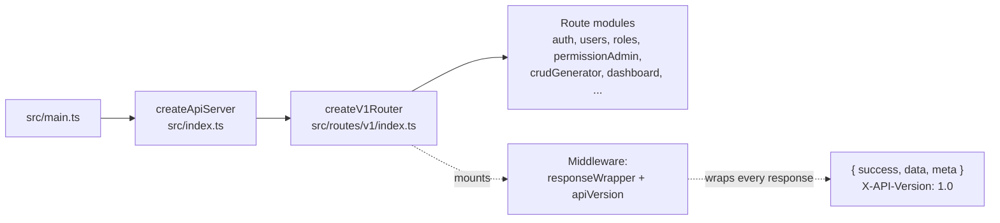

# Design Document

## Overview

This design covers six backend-only consistency and cleanup fixes (FIX-BE-1 through FIX-BE-6) for the `alsaqi-backend` repository, plus a cross-cutting no-regression constraint (Requirement 7). The work eliminates type drift in the manually-copied `packages/shared` package, removes dead and misleading route code, resolves a duplicate route registration, closes the typed-contract coverage gap, and produces a documented long-term strategy for unifying the shared package.

These are **cleanup and synchronization changes, not behavioral changes**. The guiding principle throughout is *preserve the runtime API contract*: every endpoint the frontend calls today must continue to respond with the same route path, HTTP method, status code, response shape, the unified API response envelope (`{ success, data, meta }`), and the `X-API-Version: 1.0` header. Builds (`tsc` / `npm run build`) and existing test suites must pass after each fix.

The fixes are independent and low-risk, but they share a common verification gate (build + tests + no contract change). The design treats each fix as a self-contained unit of work with explicit pre-deletion safety checks for the destructive ones (FIX-BE-2, FIX-BE-3) and an explicit consolidation strategy for the duplicate route (FIX-BE-4).

### Key research findings from the codebase

- **Live router path confirmed**: `src/main.ts` → `createApiServer` (`src/index.ts`) → `createV1Router` (`src/routes/v1/index.ts`). The file `src/routes/index.ts` (exporting `setupRoutes`) is **not** on this path.
- **`setupRoutes` references**: a workspace search found exactly one reference outside its own definition — `src/routes/__tests__/apiVersioning.test.ts` imports `setupRoutes`, `CURRENT_API_VERSION`, and `SUPPORTED_VERSIONS`. There are **zero production references**.
- **`regulatory.ts` is fully orphaned**: `createRegulatoryRoutes` is not imported or mounted anywhere. `RegulatoryService` is used only by `regulatory.ts`. The `central_bank_instructions` entity is already served end-to-end by the CRUD generator (`createCrudRoutes` → `generateRoutes("central_bank_instructions", "central-bank-instructions", "Policies")`), which returns real success responses (not `501`).
- **Duplicate `/roles/:id/permissions`**: `src/routes/roles.ts` registers `GET` and `POST /roles/:id/permissions` (payload `{ permissionIds: string[] }`), while `src/routes/permissionAdmin.ts` registers `GET` and `PUT /roles/:id/permissions` (payload `{ permissions: [{ module, action, granted }] }` with full module-registry validation, audit logging, and rollback). Both modules are mounted at `/` in `createV1Router`, so the `GET` route is a true duplicate. The frontend calls `POST`.
- **Contract coverage**: `packages/shared/src/types/endpoints/*` currently exports 10 contracts. A `risk-register` endpoint contract already exists and is exported, but it has **no matching validator**. The other listed endpoints have neither a contract nor a validator.
- **Envelope is applied by middleware**: route handlers call `res.json(rawData)`; the unified envelope and `X-API-Version` header are applied centrally by middleware (`responseWrapper`, `apiVersion`). None of these fixes touch that middleware, which is how the contract is preserved.

## Architecture

### Live request path (unchanged by these fixes)



The dead file `src/routes/index.ts` (`setupRoutes`) and the orphaned `src/routes/regulatory.ts` sit **outside** this path. Removing them does not alter any live route.

### Fix-to-requirement map

| Fix | Area | Type of change | Requirements |
|-----|------|----------------|--------------|
| FIX-BE-1 | `packages/shared/src/types/models.ts` | Add 8 type definitions (additive) | 1.1–1.12 |
| FIX-BE-2 | `src/routes/index.ts` + test migration | Delete dead code | 2.1–2.6 |
| FIX-BE-3 | `src/routes/regulatory.ts` + `RegulatoryService.ts` | Delete orphaned code | 3.1–3.7 |
| FIX-BE-4 | `src/routes/roles.ts` + `src/routes/permissionAdmin.ts` | Consolidate duplicate route | 4.1–4.10 |
| FIX-BE-5 | `packages/shared/src/types/endpoints/*` + `validators/*` | Add contracts + schemas | 5.1–5.10 |
| FIX-BE-6 | New documentation file | Architectural decision record | 6.1–6.5 |
| Cross-cutting | Middleware + all routes (verify only) | No-regression gate | 7.1–7.6 |

### Execution ordering

The recommended order minimizes risk and follows the dependency between fixes:

1. **FIX-BE-1** first (immediate type sync; prevents type errors elsewhere).
2. **FIX-BE-2, FIX-BE-3, FIX-BE-4** next (dead/duplicate code cleanup; low risk, independent).
3. **FIX-BE-5** (contract expansion; coordinate with the frontend per FIX-FE-3).
4. **FIX-BE-6** (long-term architectural decision; documentation only).

Each step ends with the same gate: `npm run build` succeeds with zero errors and the test suite passes with zero failures (Requirements 7.5, 7.6).

## Components and Interfaces

### FIX-BE-1: Synchronize `models.ts`

**Component**: `packages/shared/src/types/models.ts` (the `Models_File`).

**Change**: Append two blocks of interface declarations — a "Dashboard Stats" block and a "User Management" block — copied verbatim from the frontend copy of the file as specified in `docs/consistency-fixes-backend.md`. No existing declaration is removed or modified.

**Constraint**: After the edit, the backend `models.ts` must be **byte-for-byte identical** to the frontend `models.ts`, including comments, declaration ordering, and whitespace (Requirement 1.11). This means the appended blocks must be inserted at the exact location and with the exact formatting present in the frontend file. The implementation task must perform a byte-level comparison as its acceptance check.

**Interface surface added** (re-exported through `packages/shared/src/index.ts`, which already does `export * from './types/models'`):
`DashboardStats`, `AuditProgressByType`, `RiskLevelBreakdown`, `Role`, `Permission`, `UserSession`, `JobTitle`, `UserManagementSettings`.

### FIX-BE-2: Delete the dead `setupRoutes` code

**Component**: `src/routes/index.ts` (the `Dead_Routes_File`) and `src/routes/__tests__/apiVersioning.test.ts`.

**Procedure** (encodes the safety preconditions of Requirements 2.1–2.4):

1. **Static search of production sources** for any `import`/`require` of `setupRoutes`, `CURRENT_API_VERSION`, or `SUPPORTED_VERSIONS` from `routes/index`, excluding `*.test.ts` and `__tests__/`. Record matching paths.
2. **If any production reference exists** → abort, retain the file, report the referencing paths (Requirement 2.2). *(Current finding: zero production references, so deletion proceeds.)*
3. **Migrate the test**: `apiVersioning.test.ts` currently builds its test app with `setupRoutes(app, ...)`. Migrate it to construct the app from `createV1Router` (mounting the router under `/api/v1` and replicating the version-fallback/`X-API-Version` middleware the test asserts on), preserving all existing assertions. The version constants the test imports (`CURRENT_API_VERSION`, `SUPPORTED_VERSIONS`) move to a small constants location that the live path already relies on, or are inlined into the test, leaving zero references to the deleted module.
4. **Delete** `src/routes/index.ts` once zero references remain (Requirement 2.4).
5. **Verify**: build and test suite pass (Requirements 2.5, 2.6).

**Note on version constants**: `CURRENT_API_VERSION` and `SUPPORTED_VERSIONS` are declared in the dead file. The live router does not import them from here (it sets the version header via middleware). The migration must ensure the test obtains these values from a non-deleted source (a dedicated constants module or inline) so the deletion leaves no dangling import.

### FIX-BE-3: Remove the orphaned regulatory route file

**Components**: `src/routes/regulatory.ts` (the `Orphaned_Regulatory_File`) and `src/services/RegulatoryService.ts`.

**Procedure** (encodes Requirements 3.1–3.7):

1. **Verify the CRUD path serves the entity**: confirm `central-bank-instructions` is generated by `createCrudRoutes` and returns non-`501` success responses for supported methods (Requirement 3.1). *(Confirmed: `generateRoutes("central_bank_instructions", "central-bank-instructions", "Policies")`.)*
2. **Verify no router mounts the orphaned file** (Requirement 3.2). *(Confirmed: `createRegulatoryRoutes` is never imported/mounted.)*
3. **If any router mounts it** → abort, retain, report which router (Requirement 3.3).
4. **Delete** `regulatory.ts`. Because `RegulatoryService` is used **only** by `regulatory.ts`, it becomes dead after deletion and is also removed, leaving zero references to either (Requirement 3.4).
5. The `WHERE` clause in Requirement 3.5 (mount a dedicated regulatory route instead) is **not selected**: there is no intent to replace the working CRUD path, so the design takes the deletion branch. The CRUD generator continues to serve `POST /central-bank-instructions` with real success responses inside the envelope, which already satisfies the intent of "no `501`".
6. **Verify**: build and test suite pass (Requirements 3.6, 3.7).

### FIX-BE-4: Consolidate the duplicate `/roles/:id/permissions` route

**Components**: `src/routes/roles.ts` and `src/routes/permissionAdmin.ts`.

**Current state**:

| Module | Routes registered for `/roles/:id/permissions` | Write payload |
|--------|-----------------------------------------------|---------------|
| `roles.ts` | `GET`, `POST` | `{ permissionIds: string[] }` |
| `permissionAdmin.ts` | `GET`, `PUT` | `{ permissions: [{ module, action, granted }] }` + module-registry validation, audit logging, rollback |

The `GET` route is registered in both modules (a true duplicate). The write verbs differ (`POST` vs `PUT`).

**Decision**: Consolidate ownership of `/roles/:id/permissions` into **`permissionAdmin.ts`**, because it holds the richer behavior the requirements mandate preserving (the full permission-matrix update logic, `ModuleRegistry` validation, audit logging, and rollback — Requirement 4.4). The consolidated write operation is exposed using **`POST` only**, matching the verb the frontend calls (Requirement 4.3), and the `PUT` variant is removed (no second verb — Requirement 4.3).

**Resulting ownership**:

- `permissionAdmin.ts` owns `GET /roles/:id/permissions` (matrix read) and `POST /roles/:id/permissions` (matrix update with the preserved `permissionAdmin` logic).
- `roles.ts` no longer registers `GET` or `POST /roles/:id/permissions`. Its other routes (`GET /roles`, `GET /permissions`) remain.

**Payload reconciliation (frontend coordination point)**: the frontend currently sends `POST` with the `roles.ts` shape (`{ permissionIds }`), whereas the preserved `permissionAdmin` logic expects `{ permissions: [{ module, action, granted }] }`. Because Requirement 4.4 mandates preserving the `permissionAdmin` matrix behavior and Requirement 7.3 mandates no contract regression, the consolidated `POST` contract is the `permissionAdmin` matrix payload, and this must be aligned with the frontend change (FIX-FE-3) so both sides agree on a single documented contract. This contract is captured by the new shared contract/validator for `/v1/roles/:id/permissions` added in FIX-BE-5, giving both repositories one source of truth.

**Behavioral requirements carried into the consolidated route**:

- Valid role id + valid payload → persist and return success in the envelope (Requirement 4.5).
- Non-existent role id → error response in the envelope indicating "not found"; no stored permissions modified (Requirement 4.6).
- Invalid/malformed payload → validation error in the envelope; existing permissions retained unchanged (Requirement 4.7).

**Verification**: `logDuplicateRoutes` / `routeRegistry` reports zero duplicates for both `GET` and `POST /roles/:id/permissions` (Requirement 4.8); build and tests pass (Requirements 4.9, 4.10).

### FIX-BE-5: Close the typed-contract coverage gap

**Components**: new/updated files under `packages/shared/src/types/endpoints/*` and `packages/shared/src/validators/*`, plus the two index files (`endpoints/index.ts`, `validators/index.ts`).

**Endpoints to cover** (Requirements 5.1–5.4):

- `/v1/risk-register` — contract already exists; **add the missing validator** (`risk-register.ts` under `validators/`). The existing contract is retained.
- `/v1/central-bank-instructions` — add contract + validator.
- `/v1/dashboard-stats` — add contract + validator (response typed by the new `DashboardStats` model from FIX-BE-1).
- User-management group — add contract + validator for **each** of: `/v1/users/init`, `/v1/users/summary`, `/v1/user-management-settings`, `/v1/login-history`, `/v1/audit-trail`, `/v1/permissions`, `/v1/roles/:id/permissions` (none omitted — Requirement 5.4).

**Export wiring** (Requirements 5.5, 5.6): every new endpoint contract is re-exported from `endpoints/index.ts`, and every new validator schema (plus its inferred input type) is re-exported from `validators/index.ts`, so both repositories can import each by name. The package root `index.ts` already does `export *` from both, so no root change is needed.

**Schema fidelity** (Requirements 5.7, 5.8): each validator must accept the real HTTP 200 response body of its endpoint (zero validation errors) and reject bodies that are missing a required field or have a mismatched field type, with the error identifying the failing field. The validators are authored against the live response shapes observed in the corresponding services/routes (e.g., the CRUD generator's `select` field lists for `risk-register` and `central-bank-instructions`, `DashboardService` output for `dashboard-stats`, and the `permissionAdmin` matrix shape for `roles/:id/permissions`).

**Pattern to follow**: existing contracts (e.g., `risk-register.ts` endpoint interface keyed by `'METHOD /path'`) and existing Zod validators (e.g., `validators/findings.ts` exporting a schema plus `type X = z.infer<...>`).

### FIX-BE-6: Unified single-source strategy (documentation)

**Component**: a new documentation file (e.g., `docs/shared-package-unification-strategy.md`).

**Deliverable** (Requirements 6.1–6.5): an architectural decision record that:

- Evaluates all three candidate approaches — (a) published versioned package (e.g., private npm registry `@alsaqi/shared`), (b) git submodule, (c) monorepo — listing advantages and disadvantages of each **relative to the other two** (Requirement 6.2).
- Selects **exactly one** approach and states the rationale for choosing it over the other two (Requirement 6.1).
- Specifies, for **both** the backend and frontend repositories, the consumption mechanism under the selected approach (Requirement 6.3).
- Provides an **ordered** migration sequence covering both repositories (Requirement 6.4).
- States explicitly that adopting the selected approach makes the manual synchronization of FIX-BE-1 unnecessary going forward (Requirement 6.5).

This fix produces no code change and does not affect the runtime contract.

### Cross-cutting: preserve the API contract (Requirement 7)

No fix modifies the `responseWrapper`/`apiVersion` middleware, the route paths the frontend uses, HTTP methods (except the deliberate `PUT`→`POST` consolidation in FIX-BE-4, which removes an unused verb rather than changing a used one), status codes, or response shapes. The envelope (`{ success, data, meta }` with `success: true` on success / `success: false` on error) and the `X-API-Version: 1.0` header continue to be applied to every response by the existing middleware. The no-regression gate (build + tests, Requirements 7.5, 7.6) runs after every fix.

## Data Models

### New interfaces added to `models.ts` (FIX-BE-1)

These are appended verbatim to match the frontend copy. Field names, types, and optionality are fixed by `docs/consistency-fixes-backend.md`.

```ts
// ─── Dashboard Stats ──────────────────────────────────────────────

export interface AuditProgressByType {
  type: string;
  planned: number;
  completed: number;
}

export interface RiskLevelBreakdown {
  level: string;
  count: number;
}

export interface DashboardStats {
  audits: { total: number; completed: number; progress_by_type: AuditProgressByType[] };
  findings: { summary: { open: number; high_risk_open: number } };
  recommendations: { open: number; overdue: number };
  risks: { summary: { total: number; high: number }; byLevel?: RiskLevelBreakdown[] };
  correspondence: { incoming_total: number; outgoing_total: number; pending_responses: number };
  compliance: { total: number };
  activity: Array<Record<string, unknown>>;
}

// ─── User Management ──────────────────────────────────────────────

export interface Role { id: string | number; name: string; description?: string; }
export interface Permission { id: string | number; module: string; action: string; }
export interface UserSession {
  id: string | number;
  user_id: string | number;
  ip_address?: string;
  user_agent?: string;
  created_at?: string;
  expires_at?: string;
}
export interface JobTitle { id: string | number; name: string; name_ar?: string; name_en?: string; }
export interface UserManagementSettings {
  failed_login_threshold?: number;
  inactive_account_threshold_days?: number;
  password_min_length?: number;
  password_require_uppercase?: number;
  password_require_lowercase?: number;
  password_require_numbers?: number;
  password_require_symbols?: number;
  password_expiry_days?: number;
  enforce_single_session?: number;
  session_timeout_minutes?: number;
}
```

### New endpoint contracts (FIX-BE-5)

Each follows the existing `'METHOD /path'`-keyed interface pattern. Illustrative shape for the central-bank-instructions contract:

```ts
import type { CentralBankInstruction } from '../models';

export interface CentralBankInstructionsEndpoints {
  'GET /central-bank-instructions': {
    query: { page?: number; pageSize?: number; status?: string; category?: string };
    response: CentralBankInstruction[];
  };
  'GET /central-bank-instructions/:id': { params: { id: string }; response: CentralBankInstruction };
  'POST /central-bank-instructions': { body: Omit<CentralBankInstruction, 'id'>; response: CentralBankInstruction };
  'PUT /central-bank-instructions/:id': { params: { id: string }; body: Partial<Omit<CentralBankInstruction, 'id'>>; response: CentralBankInstruction };
  'DELETE /central-bank-instructions/:id': { params: { id: string }; response: { success: boolean } };
}
```

A `DashboardStatsEndpoints` contract types `GET /dashboard-stats` with `response: DashboardStats`. The user-management contracts (`/users/init`, `/users/summary`, `/user-management-settings`, `/login-history`, `/audit-trail`, `/permissions`, `/roles/:id/permissions`) are typed against their live response shapes (e.g., `Permission[]`, `UserManagementSettings`, `AuditTrail[]`, `UserSession[]`, and the permission-matrix object for `roles/:id/permissions`).

### New validator schemas (FIX-BE-5)

Each is a Zod schema plus its inferred input type, mirroring `validators/findings.ts`. Illustrative shape for central-bank-instructions:

```ts
import { z } from 'zod';

export const CreateCentralBankInstructionSchema = z.object({
  title: z.string().min(1).max(500),
  issue_date: z.string().min(1),
  reference_number: z.string().min(1).max(200),
  category: z.string().min(1),
  description: z.string().min(1),
  related_department: z.string().min(1),
  attachment: z.string().optional(),
  status: z.string().min(1),
});
export type CreateCentralBankInstructionInput = z.infer<typeof CreateCentralBankInstructionSchema>;
```

Validators for the read-heavy endpoints (`dashboard-stats`, `login-history`, `audit-trail`, `permissions`, `user-management-settings`) define response-validation schemas used to assert the live response body conforms to the documented contract (Requirements 5.7, 5.8).

## Correctness Properties

*A property is a characteristic or behavior that should hold true across all valid executions of a system — essentially, a formal statement about what the system should do. Properties serve as the bridge between human-readable specifications and machine-verifiable correctness guarantees.*

For this feature, property-based testing applies narrowly. Most acceptance criteria are compile-time type checks, one-shot file operations (byte comparison, deletions), structural route-registry assertions, stateful DB behavior, or middleware-driven envelope/header behavior — none of which exercise universal "for all inputs" logic in code that varies meaningfully with generated input. The exception is the **validator schemas** added in FIX-BE-5: these are pure functions over structured data with a large input space, where the acceptance criteria 5.7 (valid bodies are accepted) and 5.8 (malformed bodies are rejected, identifying the field) are genuine universal properties.

### Property 1: Valid response bodies satisfy their validator schema

*For any* endpoint covered by FIX-BE-5 and *for any* response object that conforms to that endpoint's documented response shape (including arbitrary valid field values, optional fields present or absent, and arbitrary array sizes), parsing the object with the endpoint's added Validator_Schema produces zero validation errors.

**Validates: Requirements 5.7**

### Property 2: Malformed response bodies are rejected with the offending field identified

*For any* endpoint covered by FIX-BE-5 and *for any* object obtained by taking a valid response body and either removing one required field or replacing one field's value with a value of a mismatched type, parsing the object with the endpoint's added Validator_Schema produces a validation error whose reported path identifies the removed or corrupted field.

**Validates: Requirements 5.8**

## Error Handling

These fixes are cleanup-oriented; error handling centers on **safe execution of the destructive/consolidation steps** and **preserving the existing runtime error contract**.

### Destructive-step guards (FIX-BE-2, FIX-BE-3)

- **Reference-before-delete**: Each deletion is gated on a static reference search. If a production reference is found (FIX-BE-2 / Requirement 2.2) or any router still mounts the file (FIX-BE-3 / Requirement 3.3), the task **aborts without deleting**, retains the file unchanged, and reports the blocking references/paths. This prevents leaving the build in a broken state.
- **Test migration before deletion**: For FIX-BE-2, test references are migrated to `createV1Router` and verified to leave zero references *before* the file is removed (Requirement 2.3), avoiding module-resolution failures (Requirement 2.6).
- **Cascading dead-code removal**: For FIX-BE-3, `RegulatoryService` is removed only after confirming it is referenced solely by the orphaned route (Requirement 3.4).

### Runtime error contract (unchanged — Requirement 7.4)

All runtime errors continue to flow through the existing error middleware and are returned as the standard error envelope produced by `createErrorResponse`:

```jsonc
{ "success": false, "data": null,
  "error": { "code": "...", "message": "...", "traceId": "...", "details": [ ... ] },
  "meta": { "requestId": "...", "timestamp": "...", "version": "1.0" } }
```

For the consolidated `POST /roles/:id/permissions` (FIX-BE-4), the preserved `permissionAdmin` handler keeps its existing error behaviors:

- **Role not found** → not-found error envelope; no stored permissions modified (Requirement 4.6).
- **Invalid/malformed payload** → validation error envelope; existing permissions retained (Requirement 4.7). The handler validates against the module registry and the new shared schema before any write.
- **Audit-log failure** → the existing transactional rollback restores prior permissions (preserved from `permissionAdmin.ts`).

### Validator error reporting (FIX-BE-5)

Validator schemas use Zod's structured issues so that a failing field is identifiable by path (Requirement 5.8, Property 2). No schema silently coerces away a type mismatch on a required field.

## Testing Strategy

The strategy combines a small number of property-based tests (for the FIX-BE-5 validators) with example, edge-case, integration, and smoke tests for everything else, plus the repeated build+test gate after each fix.

### Property-based tests (FIX-BE-5 validators only)

- **Library**: use the project's existing property-testing setup (`fast-check` with Vitest, consistent with the existing `*.property.test.ts` files in the repo). Do not hand-roll property testing.
- **Iterations**: each property test runs a minimum of **100 iterations**.
- **Tagging**: each property test references its design property with a comment, e.g. `// Feature: backend-consistency-fixes, Property 1: Valid response bodies satisfy their validator schema`.
- Acceptance test (Requirement 5.7, Property 1): for each new validator, generate valid response objects (via a generator derived from the schema/contract) and assert `schema.safeParse(obj).success === true`.
- Rejection test (Requirement 5.8, Property 2): for each new validator, generate a valid object, then apply a mutation (drop a required key or replace a field with a mismatched type) and assert the parse fails with an issue whose `path` points at the mutated field.

### Example and edge-case unit tests

- **FIX-BE-1**: an import test asserting all 8 new interfaces are exported; a file-comparison test asserting backend `models.ts` is byte-for-byte identical to the frontend copy (Requirement 1.11).
- **FIX-BE-4**: route-registry tests asserting `GET` and the write op for `/roles/:id/permissions` each resolve to exactly one source and that `PUT` is no longer registered (Requirements 4.1–4.3, 4.8); behavior tests for the consolidated `POST` covering valid update (4.5), non-existent role (4.6), and invalid payload with no mutation (4.7); a test confirming the preserved matrix/audit logic path (4.4).
- **FIX-BE-2 / FIX-BE-3**: guard tests for the abort branches (production reference present → abort; router still mounts file → abort).
- **FIX-BE-5**: import tests confirming each new contract and validator is importable by name from the package root (Requirements 5.5, 5.6).

### Integration tests

- **FIX-BE-3 (Requirement 3.1)**: drive `GET`/`POST central-bank-instructions` through the live router and assert a non-`501` success envelope.
- **Requirement 7 (no regression)**: rely on and extend the existing backward-compatibility suite (`src/__tests__/backwardCompat.property.test.ts`, `responseEnvelope.property.test.ts`) to confirm path/method/status/shape, the `success` flag, and `X-API-Version: 1.0` are unchanged for pre-existing endpoints (Requirements 7.1–7.4). The migrated `apiVersioning.test.ts` (FIX-BE-2) continues to assert version-header and version-routing behavior via `createV1Router`.

### Smoke / build gate

- After **each** fix: run `npm run build` (`tsc`) and assert zero compilation errors, then run the full test suite and assert zero failures (Requirements 1.12, 2.5–2.6, 3.6–3.7, 4.9–4.10, 5.9–5.10, 7.5–7.6).
- **FIX-BE-2 / FIX-BE-3**: static-search smoke checks asserting zero remaining references to the deleted symbols/files.

### Documentation review (FIX-BE-6)

The unification strategy document is verified against a content checklist (one approach selected with rationale; advantages/disadvantages for all three approaches; per-repository consumption mechanism; ordered migration steps for both repos; explicit statement that it supersedes the FIX-BE-1 manual sync). This is a review gate, not an automated test (Requirements 6.1–6.5).
