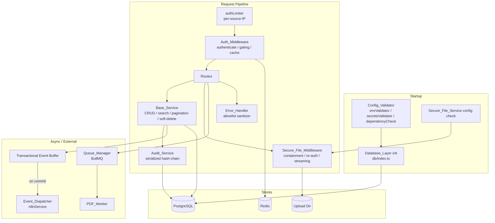
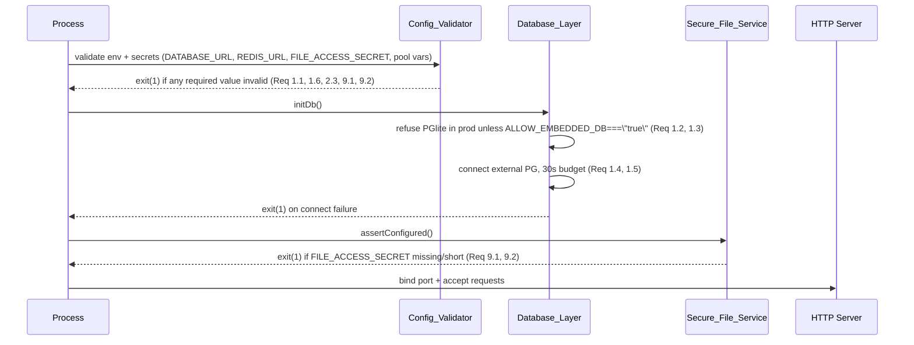

# Design Document

## Overview

This design specifies how the `alsaqi-backend` service will be hardened to close the 27
requirements derived from the production-readiness audit. The work spans seven concern areas:

1. **Database safety** — fail-fast production configuration, configurable pooling, and
   consistent soft-delete semantics (Requirements 1, 2, 25).
2. **Authentication & authorization** — path-safe password-change gating, non-blocking and
   anti-enumeration login, cache invalidation, refresh-token hashing, source-IP rate
   limiting, and configurable cookie paths (Requirements 3, 14, 15, 16, 17, 18, 19).
3. **CRUD safety** — schema-driven column whitelisting, configurable search columns, and
   keyset pagination (Requirements 4, 5, 6).
4. **Audit-trail integrity** — a single serialized, transactional, verifiable hash-chain
   writer (Requirement 7).
5. **Secure file serving** — dedicated signing secret, path containment, signer
   re-authorization, streamed decryption, and resilient denial logging (Requirements 9, 10,
   11, 12, 13).
6. **Resilience** — transactional event dispatch, bounded failed-job retention, PDF job
   timeouts, and graceful shutdown/draining (Requirements 20, 21, 22, 23).
7. **Code structure & safety nets** — allowlist error sanitization, a typed core data-access
   layer, and consolidation of duplicated modules (Requirements 24, 26, 27).

The design treats the project's existing capabilities — RS256 JWTs, parameterized queries,
the permission registry (`src/permissions/`), Zod schemas (`src/schemas/`), the Redis-backed
auth cache, the `cursorPagination` utility, the `FileEncryptionService`, and the BullMQ
`QueueManager` — as building blocks. Wherever a capability already exists but is incorrectly
applied (for example, the duplicated `logAudit` hash-chain writers in `BaseService` and
`AuthService`, or the JWT-secret fallback in `SecureFileService`), the design replaces the
incorrect usage rather than re-implementing the capability from scratch.

A central principle throughout is **fail closed**: misconfiguration that could cause silent
data loss, forged artifacts, or bypassed access controls must cause the affected operation to
abort (or the process to terminate at startup) rather than degrade silently.

### Research Notes

- **`pg.Pool` acquisition timeout.** `node-postgres` exposes `connectionTimeoutMillis` (time
  to acquire a connection from the pool, including establishing a new TCP connection when the
  pool is below `max`) and `max` (pool size). When the pool is saturated and no connection
  becomes available within `connectionTimeoutMillis`, `pool.connect()` rejects with a timeout
  error. This maps directly to Requirements 2.1, 2.2, and 2.4. The current code hardcodes
  `max: 20` and `connectionTimeoutMillis: 2000` in `src/db/index.ts`; these become
  environment-driven.
- **BullMQ failed-job retention.** BullMQ supports `removeOnFail` as a boolean or as
  `{ count, age }`. Setting `removeOnFail: { count: N }` keeps at most the `N` most recent
  failed jobs, evicting the oldest first — exactly the bounded retention required by
  Requirement 21. The current config uses `removeOnFail: false` (unbounded).
- **Express 5 response objects.** Express 5 (this project targets Express 5 per Requirement 13)
  discourages monkey-patching `res.json`. The replacement uses the `res.on('finish')` event
  and reads `res.statusCode` to record denials without wrapping any response method.
- **Path containment on Windows + POSIX.** Node's `path.resolve` plus `fs.realpathSync` (to
  dereference symlinks) followed by a separator-aware prefix check (`resolved === base` or
  `resolved.startsWith(base + path.sep)`) is the standard containment technique and correctly
  rejects sibling directories such as `uploads_backup`. `path.sep` makes this
  platform-correct, satisfying Requirement 10.2.
- **Streaming AES-GCM decryption.** Node's `crypto.createDecipheriv` is a `Transform` stream;
  piping `createReadStream(encryptedPath) → decipher → res` decrypts in chunks bounded by the
  stream `highWaterMark` (default 64 KB), keeping resident memory bounded independent of file
  size (Requirement 12). GCM auth-tag verification happens on `decipher.final()`, so a
  tampered chunk surfaces as a stream `error` event.
- **Deriving column whitelists from Zod.** A Zod object schema exposes its field names via
  `schema.shape` (for `ZodObject`). Enumerating `Object.keys(schema.shape)` yields the exact
  writable field set per Requirement 4.2 without maintaining a parallel list.

## Architecture

### High-Level Component Map



### Startup Sequence (Fail-Fast Ordering)

Requirements 1, 2, 9, and 27 require certain checks to run **before any port binding or
request handling**. The startup order is:



The key change is that **all fatal configuration checks complete before `server.start()`**.
Today `SecureFileService.getSecret()` silently falls back to the JWT secret or a hardcoded
literal; that fallback is removed and replaced by an explicit startup assertion.

### Module Consolidation Strategy (Requirement 27)

Three duplicated areas are consolidated:

| Concern | Current state | Consolidated target |
|---|---|---|
| Audit-log append | `BaseService.logAudit` **and** `AuthService.logAudit` (two hash-chain writers) | Single `AuditChainService.append()` in `src/services/AuditChainService.ts`; both callers delegate to it |
| Migrations | `db/migrationRunner.ts` + `db/migrations.ts` + `db/versionedMigrations.ts` | One runner module + one definitions module; remove the redundant third |
| Auth routes | `routes/auth.ts` **and** `routes/auth/*` | Keep the modular `routes/auth/` tree; remove `routes/auth.ts`; update `routes/index` wiring |

A static-analysis guard (a unit test plus an optional lint rule) asserts there is exactly one
implementation of each, failing the build otherwise (Requirement 27.5).

## Components and Interfaces

### 1. Database_Layer (`src/db/index.ts`, `src/db/poolConfig.ts`)

**Responsibilities:** fail-fast production config, configurable pool, typed wrapper.

New helper module `src/db/poolConfig.ts`:

```ts
export interface PoolConfig {
  max: number;                    // 1..1000, default 20  (Req 2.1)
  connectionTimeoutMillis: number;// 1..60000, default 2000 (Req 2.2)
}

export interface PoolConfigError {
  variable: string;               // which env var was rejected
  acceptedRange: string;          // human-readable range
  received: string;
}

/** Pure parser. Returns either a valid config or a descriptive error (Req 2.1–2.3). */
export function parsePoolConfig(env: NodeJS.ProcessEnv):
  | { ok: true; config: PoolConfig }
  | { ok: false; error: PoolConfigError };

export interface DbUrlClassification {
  kind: 'valid-external' | 'missing' | 'http-url';
  normalized: string | null;      // trimmed value
}

/** Pure classifier for DATABASE_URL (Req 1.1, 1.4). Case-insensitive, trims whitespace. */
export function classifyDatabaseUrl(raw: string | undefined): DbUrlClassification;

/** Pure predicate: may PGlite be used? (Req 1.2, 1.3) */
export function isEmbeddedDbAllowed(env: NodeJS.ProcessEnv): boolean; // ALLOW_EMBEDDED_DB === 'true'
```

**Behavioral changes in `initDb`:**

- Compute `classifyDatabaseUrl(DATABASE_URL)`. In production, a `missing` or `http-url`
  classification logs a fatal error naming the offending value and calls `process.exit(1)`
  before any port binding (Req 1.1).
- In production, PGlite is permitted only when `isEmbeddedDbAllowed(env)` is true; otherwise
  PGlite is never initialized (Req 1.2). When `ALLOW_EMBEDDED_DB === 'true'`, PGlite is
  permitted regardless of `NODE_ENV` (Req 1.3).
- When `DATABASE_URL` is a valid external URL, only a `pg.Pool` is created — never a PGlite
  instance (Req 1.4).
- External connection establishment has a hard 30-second budget from process start; failure
  logs a fatal connection error and exits non-zero without creating PGlite (Req 1.5). The
  existing `connectWithRetry` is reused, with retry count × interval bounded to ≤ 30 s.
- The `pg.Pool` is constructed from `parsePoolConfig(env)`; an invalid pool variable aborts
  startup with a message naming the variable and its accepted range (Req 2.3). Pool
  acquisition timeouts surface as a returned error (`pool acquisition timeout`) without
  terminating the process (Req 2.4).

**Typing (Requirement 26):** `IDBWrapper`, `DBWrapper`, `getPool`, and the prepared-statement
shape are given explicit types with no `any` in public signatures. A `tsconfig` check (or a
scoped `eslint` `no-explicit-any` rule over `src/db/index.ts` and `src/middleware/auth.ts`)
fails the type-check with diagnostics on violation (Req 26.3, 26.4).

### 2. Config_Validator (`src/config/envValidator.ts`, `src/startup/dependencyCheck.ts`, `src/utils/secretsValidator.ts`)

- The production dependency check treats an unset or whitespace-only `DATABASE_URL` or
  `REDIS_URL` as a **failed** dependency rather than a skipped one (Req 1.6). The current
  `main.ts` guard `if (databaseUrl && redisUrl)` is inverted into an explicit
  "missing → fail" branch.
- `secretsValidator` gains a `FILE_ACCESS_SECRET` rule: required, non-whitespace, ≥ 32
  characters (Req 9.1, 9.2).

### 3. Auth_Middleware (`src/middleware/auth.ts`)

**Path-safe password-change gating (Requirement 3).** New pure helper module
`src/middleware/pathGate.ts`:

```ts
/** Percent-decode, resolve '.'/'..', strip one trailing slash (Req 3.3). */
export function canonicalizePath(rawPath: string): string;

/**
 * Exact match OR path-segment-boundary prefix match against allowedPaths.
 * Never substring; never consults query strings (Req 3.1, 3.2, 3.4).
 */
export function isPathAllowed(canonicalPath: string, allowedPaths: readonly string[]): boolean;
```

The gate uses `req.path` only (never `req.originalUrl` or query string). Allowed paths are the
canonical password-change route and `/auth/logout` (plus refresh/session), matched by exact or
segment-boundary prefix so `/auth/logout-evil` is rejected (Req 3.4, 3.6). A non-allowed route
is denied with a `PASSWORD_CHANGE_REQUIRED` response regardless of any query string (Req 3.5).

**Cache invalidation (Requirement 16).** The existing Redis auth cache keys entries by
`session_version`. Consolidation:

- A single `AuthCacheInvalidator.invalidate(userId)` is the canonical path, called from every
  suspend/disable and role/permission-change code path (Req 16.1, 16.2) within 1 second.
- On invalidation failure, retry up to 3 times; on exhaustion, force a DB re-read on the next
  request and record an error identifying the user (Req 16.4).
- After invalidation, `authenticate` re-reads status/role from the authoritative store rather
  than serving stale values (Req 16.3). If the store is unreachable during that re-read, the
  request is **denied** (not served from cache) with an "auth state unverifiable" error
  (Req 16.5).

**Source-IP rate limiting (Requirement 18).** `authLimiter` is re-keyed from `ip_username` to
the source IP **only**, so attempts are counted across usernames (Req 18.1). Limit 10 /
900 s, both configurable. On limit, subsequent attempts are rejected without evaluating
credentials and the response includes seconds-remaining (`Retry-After`) (Req 18.2, 18.3).
Window expiry resets the counter (Req 18.4).

**Typing (Requirement 26):** request/response handlers use explicit
`Request`/`Response`/`NextFunction` and a typed `AuthenticatedRequest` (with `req.user`
shape), eliminating `any` from public signatures.

### 4. Auth_Service (`src/services/AuthService.ts`)

**Non-blocking + anti-enumeration login (Requirements 14, 15).** New pure/helper module
`src/services/passwordVerifier.ts`:

```ts
/** Always async bcrypt.compare; never compareSync (Req 14.1, 14.2). */
export function verifyPassword(plain: string, hash: string): Promise<boolean>;

/** Fixed dummy hash at the configured cost factor for unknown accounts (Req 15.1, 15.5). */
export const DUMMY_HASH: string;
export function bcryptCostFactor(): number;
```

Login flow changes:

- Replace `bcrypt.compareSync` with `await bcrypt.compare` (Req 14.1, 14.2, 14.4). On reject,
  the enclosing transaction rolls back and a generic verification-failed error is returned;
  the process never crashes (Req 14.5).
- For an unknown account, perform a bcrypt comparison against `DUMMY_HASH` (same cost factor)
  before responding (Req 15.1, 15.5).
- The four failure conditions (unknown account, wrong password, suspended, locked) return one
  **byte-for-byte identical** generic failure response with the same status code (Req 15.2,
  15.3). The current code throws differentiated `AuthError`/`ForbiddenError`; these are
  unified into a single `InvalidCredentialsError` mapped to one canonical response.

**Lockout notifications (Requirement 8).** The admin query is parameterized
(`role = ?` bound, status `Active`) rather than string-interpolated (Req 8.2). All
notification inserts for one lockout event run inside the lockout transaction; exactly one row
per active admin (Req 8.1, 8.3); zero rows when no active admin exists, without error
(Req 8.4); a failure rolls back all notification rows for that event while preserving the
lockout state (Req 8.5).

**Refresh-token hashing (Requirement 17).** New helper `hashRefreshToken(token): string`
returns the SHA-256 hex digest. On persist, only the hash is stored — never plaintext in DB or
logs (Req 17.1). Validation hashes the presented token and compares full-length for exact
match (Req 17.2). Non-matching tokens are rejected without issuing new tokens and leave
session state unchanged (Req 17.3). Absent/empty/>4096-char tokens are rejected without
hashing (Req 17.4). A hashing failure aborts persistence without storing plaintext (Req 17.5).

**Configurable refresh-cookie path (Requirement 19).** New helper
`buildRefreshCookiePath(apiPrefix, refreshRoute): string` combines the configured API prefix
with the refresh route, applies the default prefix when the configured value is
absent/empty/whitespace (Req 19.3), and normalizes to exactly one leading `/` and no trailing
`/` except root (Req 19.4). The path is computed from the **current** configured prefix at
issuance time (Req 19.1, 19.5) so the cookie path matches where the refresh endpoint is served
(Req 19.2).

### 5. Base_Service (`src/services/BaseService.ts`) + supporting modules

**Column whitelisting (Requirement 4).** New module `src/services/columnWhitelist.ts`:

```ts
import { ZodObject } from 'zod';

/** table → Zod schema registry (Req 4.2). */
export const TABLE_WRITE_SCHEMAS: Record<string, ZodObject<any>>;

/** Field names declared in the table's Zod schema; everything else is non-whitelisted. */
export function getColumnWhitelist(tableName: string): Set<string>;

export interface WhitelistResult {
  ok: boolean;
  rejectedKeys: string[];   // top-level keys not in whitelist
}

/** Pure check over a request body's top-level keys (Req 4.1, 4.3, 4.4). */
export function checkWhitelist(tableName: string, body: Record<string, unknown>): WhitelistResult;
```

`create`/`update` reject the **entire** request with a `ValidationError` naming the
non-permitted keys when any top-level key is outside the whitelist; no row is created or
modified (Req 4.3). Restricted fields (`status`, `deleted_at`, ownership fields, `role`) are
never written unless explicitly whitelisted for that table (Req 4.4). Rejection returns within
1000 ms (it is a pure pre-DB check) (Req 4.5). This replaces the current denylist
(`immutableFields`) approach with a schema-driven allowlist.

**Configurable search columns (Requirement 5).** New module
`src/services/searchColumns.ts`:

```ts
/** table → explicit set of searchable columns. Tables absent here have NO search columns. */
export const TABLE_SEARCH_COLUMNS: Record<string, readonly string[]>;

export function getSearchColumns(tableName: string): readonly string[];

/** Builds a search clause + params, or null when no clause should apply (Req 5.1, 5.2, 5.4). */
export function buildSearchClause(tableName: string, term: string | null | undefined):
  | { clause: string; params: string[] }
  | null;
```

`buildSearchClause` returns `null` (no clause) when the table has no configured columns or the
term is null/empty/whitespace — and it **never** falls back to `title`/`name`/`description`
(Req 5.2, 5.4). `findAll` runs the query without a search clause in those cases and returns a
successful unfiltered result (Req 5.2, 5.3). The current hardcoded `searchColumns` map plus the
`['title','name','description']` fallback is removed.

**Keyset pagination (Requirement 6).** The existing `cursorPagination.ts` is extended to
support a composite, deterministic ordering key and integrated into `findAll` for
large-table-configured endpoints:

```ts
/** Large-table endpoints opt in via this registry. */
export const KEYSET_TABLES: Record<string, { orderKey: readonly string[] }>; // e.g. ['created_at','id']

export interface KeysetPageRequest { cursor?: string | null; pageSize?: number; } // 1..100, default 25
export interface KeysetPage<T> { data: T[]; nextCursor: string | null; }
```

The order key composes one or more columns that uniquely and deterministically order rows
(e.g. `(created_at, id)`) (Req 6.1). Page size is clamped to 1..100 with default 25 (Req 6.2).
A non-null `nextCursor` is returned iff more rows remain (Req 6.3, 6.4). Total counts for
large tables come from a cached/estimated source no older than 60 s (a `pg_class.reltuples`
estimate or a 60-second TTL cache) rather than `COUNT(*)` per request (Req 6.5). A malformed or
undecodable cursor is rejected with an "invalid cursor" error and no page rows (Req 6.6).

**Consistent soft-delete (Requirement 25).** `delete` is changed from hard `DELETE` to a
`deleted_at = now()` `UPDATE` for tables with a `deleted_at` column (Req 25.1). Soft-deleted
rows remain physically present and retrievable via an explicit `includeDeleted` option
(Req 25.2). `findAll`/`findById` exclude `deleted_at IS NOT NULL` rows by default (Req 25.3) —
already implemented and retained. Deleting an already-soft-deleted row makes no change and
returns a not-found indication (Req 25.4). A distinctly named `hardDelete(...)` performs
physical removal and is never invoked by the default `delete` path (Req 25.5).

**Transactional event dispatch (Requirement 20).** New module
`src/services/transactionalEvents.ts` backed by an `AsyncLocalStorage` event buffer keyed to
the active DB transaction:

```ts
export interface BufferedEvent { name: string; payload: unknown; }

/** Buffer an event for the current transaction instead of dispatching now (Req 20.1). */
export function enqueueEvent(event: BufferedEvent): void;

/** On commit: dispatch buffered events in order, then release the buffer (Req 20.2, 20.5). */
export function flushOnCommit(): Promise<void>;

/** On rollback: discard buffered events (Req 20.3). */
export function discardOnRollback(): void;
```

`BaseService.create/update/delete` call `enqueueEvent` instead of `N8nService.sendEvent`
directly. The `DBWrapper.transaction` wrapper flushes the buffer after a successful commit and
discards it on rollback. The `Event_Dispatcher` (`N8nService` via `CircuitBreaker`) dispatches
each buffered event within 5 s of commit, in buffer order (Req 20.2); retries up to 3
additional attempts on failure/10 s timeout and records a dispatch failure without rolling back
the committed transaction (Req 20.4); releases the buffer when all events are dispatched or
exhausted (Req 20.5).

### 6. Audit_Service (`src/services/AuditChainService.ts`) — Requirement 7 & 27

A single canonical hash-chain writer replaces both `BaseService.logAudit` and
`AuthService.logAudit`:

```ts
export interface AuditEntryInput {
  user: string; action: string; module: string; details: string;
}

export class AuditChainService {
  /**
   * Appends one entry. Read-prev-hash + compute-hash + insert run as ONE atomic,
   * mutually-exclusive critical section, serialized across concurrent callers
   * (Req 7.1, 7.2, 7.3). Rolls back on any failure with no partial entry (Req 7.5).
   */
  static append(entry: AuditEntryInput): Promise<void>;

  /**
   * Recomputes every entry's hash from recorded content + recorded previous-hash,
   * confirms single-predecessor linkage, reports the first offending entry on
   * fork/gap/mismatch (Req 7.4, 7.6).
   */
  static verifyChain(): Promise<
    | { valid: true }
    | { valid: false; firstOffendingId: string; reason: 'hash-mismatch' | 'fork' | 'gap' }
  >;
}
```

**Serialization mechanism.** Concurrent appends are serialized using a database-level
guarantee rather than in-process locking alone, because the service may run multi-instance.
The append executes inside a transaction that takes a PostgreSQL advisory lock
(`pg_advisory_xact_lock(<audit-chain-key>)`) — or, in PGlite/dev mode, the existing
`ReadWriteLock` write lock — so the read-prev-hash → compute → insert steps cannot interleave
(Req 7.2). Because every append observes the committed tail under the lock, each new entry's
`previous_hash` equals exactly one prior entry's `hash`, producing a single linear chain with
no two entries sharing a `previous_hash` (Req 7.3). The insert is part of the transaction; any
failure before durable insert rolls back, leaving the chain in its pre-append state and
returning a failure to the caller (Req 7.5).

**Verification.** `verifyChain` walks entries in chain order, recomputing
`sha256(previous_hash | user | action | module | details | timestamp)` and comparing to the
stored hash; it confirms each `previous_hash` links to exactly one existing prior entry and
that no entry is unreferenced/missing, returning the first offending entry id on any
mismatch/fork/gap without mutating any entry (Req 7.4, 7.6).

### 7. Secure_File_Service (`src/services/SecureFileService.ts`) — Requirements 9, 11

- `getSecret()` is replaced by `assertConfigured()` (called at startup) and an internal
  `requireSecret()` that reads `FILE_ACCESS_SECRET` only — **no** JWT-secret or hardcoded
  fallback (Req 9.3, 9.4). Missing/short secret terminates the process at startup (Req 9.1,
  9.2).
- `clampTtl` max is reduced from 7 days to **900 seconds** so issued URLs never exceed the
  configured maximum TTL (Req 11.4).
- Signature verification uses `FILE_ACCESS_SECRET`; a signature not produced with the current
  secret fails verification (Req 9.5).

### 8. Secure_File_Middleware (`src/middleware/secureFile.ts`) — Requirements 10, 11, 12, 13

**Path containment (Requirement 10).** New pure helper `src/middleware/pathContainment.ts`:

```ts
export interface ContainmentResult { contained: boolean; resolvedPath: string | null; }

/**
 * Resolve to canonical absolute path (collapse '.'/'..', deref symlinks), then confirm it
 * begins with resolvedUploadDir + path.sep (sibling dirs like uploads_backup are NOT
 * contained) (Req 10.1, 10.2, 10.4).
 */
export function checkContainment(uploadDir: string, requestedRelPath: string): ContainmentResult;
```

A non-contained path is denied with an opaque "file unavailable" response that never discloses
the resolved path or target existence (Req 10.3), and a security event is recorded server-side
(Req 10.5).

**Signer re-authorization (Requirement 11).** Before serving any content for a signed URL, the
middleware re-evaluates the signer's **current** account status and required permission against
live records (Req 11.1). If status ≠ active or the permission is missing at serve time, the
request is denied even when the signature is still valid and unexpired (Req 11.2). Expired or
invalid signatures are denied (Req 11.3).

**Streaming decryption (Requirement 12).** `serveEncryptedFile` is rewritten to stream:
`createReadStream(encryptedPath) → crypto.createDecipheriv(...) → res`, processing ≤ 64 KB
chunks and writing each before decrypting the next, never holding the whole plaintext in memory
(Req 12.1, 12.2). For files above the configurable streaming threshold (default 1 MB, range
1 KB–1 GB), additional resident memory stays ≤ 10 MB regardless of file size (Req 12.3). A
chunk decryption/auth-tag failure terminates the response stream with a delivery-failed error
(Req 12.4). Client disconnect (`res`/`req` `close`) stops reading/decrypting and releases the
stream and file handle (Req 12.5). The current `FileEncryptionService.decryptFile` returns a
full buffer; a streaming `createDecryptStream(fileId)` API is added.

**Resilient denial logging (Requirement 13).** The `res.json` monkey-patch is removed. Denials
are logged via a `res.on('finish')` listener that inspects `res.statusCode`, emitting exactly
one denial entry per denied request (Req 13.1, 13.2). Each entry carries the requested file
identifier and a denial-category reason (authentication failure, expired signed URL, missing
module permission, no valid owning module) (Req 13.2). When no authenticated user exists, the
user id is recorded as a fixed anonymous placeholder (Req 13.3). A logging-write failure does
not change the response status/body and writes a failure notice to stderr (Req 13.4).

### 9. Error_Handler (`src/middleware/error.ts`) — Requirement 24

The denylist (`TABLE_NAME_PATTERNS`, `SANITIZATION_PATTERNS`) is replaced by an **allowlist**
sanitizer:

```ts
/** Statically defined field-name allowlist for client-facing error objects (default-deny). */
export const CLIENT_ERROR_FIELD_ALLOWLIST: readonly string[]; // e.g. ['code','message','traceId','field']

/** Returns a new object containing only allowlisted fields (Req 24.1, 24.2). */
export function sanitizeErrorForClient(error: Record<string, unknown>): Record<string, unknown>;
```

Only fields whose names match an allowlist entry are included; everything else is omitted
regardless of value/origin (Req 24.1, 24.2). Internal details — table/column names, SQL
fragments, stack traces, file paths, hostnames — are excluded because they are not on the
allowlist, and the client receives a generic category indication (Req 24.3). Identifiers
introduced after the rules were authored are excluded automatically because exclusion is driven
by absence from the allowlist (Req 24.4). The complete unsanitized error is preserved in the
server-side log (Req 24.5).

### 10. Queue_Manager (`src/queues/queueManager.ts`) — Requirement 21

New pure helper:

```ts
export function parseFailedJobRetention(raw: string | undefined):
  | { ok: true; limit: number }                 // 1..100000, default 1000
  | { ok: false; reason: string };
```

`removeOnFail: false` becomes `removeOnFail: { count: parseFailedJobRetention(env).limit }`
(Req 21.1, 21.2 — BullMQ evicts oldest-first to the limit). An invalid value rejects the queue
configuration, retains the previously applied valid limit, and returns an error (Req 21.3).

### 11. PDF_Worker (`src/queues/workers/pdfWorker.ts`) — Requirement 22

New pure helper `parsePdfTimeout(raw): number` clamps to 5–300 s, default 30 s for
absent/non-numeric/out-of-range values (Req 22.1, 22.2). The worker races job processing
against a timeout; on timeout it aborts within 1 s (Req 22.3), returns the browser instance to
the `BrowserPool` and closes the page within 1 s (Req 22.4), and marks the job failed with a
reason including elapsed and configured max time (Req 22.5).

### 12. Graceful Shutdown (`src/main.ts`, server module) — Requirement 23

The shutdown handler is rewritten to drain:

```ts
export function createGracefulShutdown(server: http.Server, opts: { drainTimeoutMs: number }):
  (signal: string) => Promise<void>; // drainTimeoutMs: 1000..120000, default 30000
```

On a shutdown signal the server stops accepting new connections (Req 23.1) and allows in-flight
requests to finish within the configurable drain timeout (Req 23.2). Completion before timeout
exits 0 (Req 23.3); otherwise remaining requests are terminated and the process exits non-zero
after the timeout (Req 23.4). `uncaughtException` follows the same drain-then-exit path rather
than exiting immediately (Req 23.5, 23.6).

## Data Models

### Configuration (environment) model

| Variable | Type / Range | Default | Requirement |
|---|---|---|---|
| `DATABASE_URL` | string; non-http(s) external PG URL in prod | — (required in prod) | 1.1, 1.4 |
| `ALLOW_EMBEDDED_DB` | exactly `"true"` to enable PGlite | unset (disabled) | 1.2, 1.3 |
| `DB_POOL_MAX` | integer 1..1000 | 20 | 2.1 |
| `DB_POOL_ACQUIRE_TIMEOUT_MS` | integer 1..60000 | 2000 | 2.2 |
| `FILE_ACCESS_SECRET` | string ≥ 32 chars | — (required) | 9.1, 9.2 |
| `FILE_SIGNED_URL_MAX_TTL_S` | integer ≤ 900 | 900 | 11.4 |
| `FILE_STREAM_THRESHOLD_BYTES` | integer 1024..1073741824 | 1048576 | 12.3 |
| `AUTH_RATE_LIMIT_MAX` | integer | 10 | 18.1 |
| `AUTH_RATE_LIMIT_WINDOW_S` | integer | 900 | 18.1 |
| `API_PREFIX` | string path | `/api/v1` | 19.1, 19.3 |
| `QUEUE_FAILED_RETENTION` | integer 1..100000 | 1000 | 21.1 |
| `PDF_JOB_TIMEOUT_S` | integer 5..300 | 30 | 22.1 |
| `SHUTDOWN_DRAIN_TIMEOUT_MS` | integer 1000..120000 | 30000 | 23.2 |

### Audit_Chain row (`audit_trail`)

| Column | Type | Notes |
|---|---|---|
| `id` | uuid/serial | primary key, chain order via `(timestamp, id)` |
| `user` | text | actor username |
| `action` | text | |
| `module` | text | |
| `details` | text | |
| `previous_hash` | text | hash of the immediately preceding entry; `'0'` for genesis |
| `hash` | text | `sha256(previous_hash \| user \| action \| module \| details \| timestamp)` |
| `timestamp` | timestamp | |

Invariant: for every non-genesis entry there is exactly one prior entry whose `hash` equals this
entry's `previous_hash`; no two entries share a `previous_hash` (Req 7.3).

### Signed_File_URL model

Query parameters on `/api/v1/files/<encodedPath>`: `expires` (unix seconds, ≤ now + 900),
`userId`, `sig` (HMAC-SHA256 over `filePath:userId:expires` keyed by `FILE_ACCESS_SECRET`).
Verification re-checks signer status + permission at serve time (Req 11).

### Refresh token storage (`refresh_tokens`, `user_sessions`)

Stored value is the SHA-256 hex digest of the issued token; plaintext is never persisted or
logged (Req 17.1). Lookups compute the hash of the presented token and compare full-length.

### Keyset cursor model

Opaque base64url-encoded JSON of the composite order-key values, e.g.
`{ "created_at": "...", "id": "..." }`. Decoding failure → invalid-cursor error (Req 6.6).

### Transactional event buffer

Per-transaction in-memory ordered list of `{ name, payload }`, held in `AsyncLocalStorage`,
flushed on commit and discarded on rollback (Req 20).

## Correctness Properties

*A property is a characteristic or behavior that should hold true across all valid executions
of a system — essentially, a formal statement about what the system should do. Properties serve
as the bridge between human-readable specifications and machine-verifiable correctness
guarantees.*

The following properties cover the acceptance criteria that test this service's own logic
across a wide input space. Criteria that verify infrastructure, timing/performance, process
exit, build configuration, or one-time structural facts are validated by integration, smoke,
and example tests instead (see Testing Strategy) and are intentionally not expressed as
universally-quantified properties.

### Property 1: DATABASE_URL classification

*For any* string value of `DATABASE_URL` (including unset, whitespace-only, mixed-case
`http://`/`https://` prefixes with surrounding whitespace, and well-formed external URLs),
`classifyDatabaseUrl` returns `missing` for unset/whitespace-only input, `http-url` for any
value that begins with `http://` or `https://` after trimming and case-folding, and
`valid-external` otherwise.

**Validates: Requirements 1.1, 1.4**

### Property 2: Embedded-DB permission is independent of environment

*For any* combination of `NODE_ENV` and `ALLOW_EMBEDDED_DB` values, `isEmbeddedDbAllowed`
returns true if and only if `ALLOW_EMBEDDED_DB` is exactly the string `"true"`, regardless of
`NODE_ENV`.

**Validates: Requirements 1.2, 1.3**

### Property 3: Pool configuration parsing and validation

*For any* values of the pool environment variables, `parsePoolConfig` accepts a value only when
it is an integer within its range (max 1..1000, acquire-timeout 1..60000), substitutes the
documented default (20, 2000) when a variable is unset, and otherwise returns a failure that
names the rejected variable and its accepted range. Also covers Requirement 1.6: for any
unset/whitespace-only `DATABASE_URL` or `REDIS_URL`, the dependency check reports a failed
dependency rather than skipping it.

**Validates: Requirements 1.6, 2.1, 2.2, 2.3**

### Property 4: Path canonicalization

*For any* request path string, `canonicalizePath` produces a path that is percent-decoded, has
all `.` and `..` segments resolved, and has at most no trailing slash removed beyond a single
one (root `/` preserved).

**Validates: Requirements 3.3**

### Property 5: Allowed-path matching is exact or segment-boundary prefix only

*For any* canonical path and allowed-paths list, `isPathAllowed` returns true exactly when the
path equals an entry or extends an entry at a path-separator boundary, and returns false for
substring-but-not-segment matches (for example `/auth/logout-evil` against `/auth/logout`); it
never consults query strings or `originalUrl`.

**Validates: Requirements 3.1, 3.2, 3.4**

### Property 6: Column whitelist equals schema field set

*For any* table registered in `TABLE_WRITE_SCHEMAS`, `getColumnWhitelist` returns exactly the
set of field names declared in that table's Zod schema, treating any name not declared in the
schema as not whitelisted.

**Validates: Requirements 4.2**

### Property 7: Mass-assignment rejection

*For any* request body and target table, if the body contains one or more top-level keys absent
from the table's column whitelist (including restricted fields such as `status`, `deleted_at`,
ownership fields, and `role`), then `checkWhitelist` reports rejection listing exactly those
keys and no whitelisted-filtered write would include any non-whitelisted key; when all keys are
whitelisted it reports acceptance.

**Validates: Requirements 4.1, 4.3, 4.4**

### Property 8: Search clause uses only configured columns

*For any* table and search term, `buildSearchClause` returns `null` (no clause) when the term is
null/empty/whitespace or the table has no configured search columns, and otherwise returns a
clause that references only columns in that table's configured search set — never falling back
to `title`, `name`, or `description`.

**Validates: Requirements 5.1, 5.2, 5.4**

### Property 9: Keyset pagination round-trip

*For any* dataset of rows with a deterministic composite order key and any page size, paging
from the first cursor to exhaustion yields every row exactly once in the defined order with no
duplicates or gaps, clamps page size to 1..100 (default 25), and returns a non-null
`nextCursor` if and only if more rows remain after the current page.

**Validates: Requirements 6.1, 6.2, 6.3, 6.4**

### Property 10: Malformed cursor rejection

*For any* string that is not a valid encoded cursor, decoding fails and the keyset query is
rejected with an invalid-cursor error and returns no page rows.

**Validates: Requirements 6.6**

### Property 11: Audit chain remains linear under concurrency

*For any* set of audit entries appended concurrently through `AuditChainService.append`, the
resulting chain is linear: each non-genesis entry's `previous_hash` equals the `hash` of exactly
one prior entry, and no two entries share the same `previous_hash`.

**Validates: Requirements 7.2, 7.3**

### Property 12: Append-then-verify round trip

*For any* sequence of audit entries appended in order, `verifyChain` recomputes each entry's hash
from its recorded content and recorded previous-hash, finds every recomputed hash equal to the
stored hash with single-predecessor linkage, and reports the chain valid.

**Validates: Requirements 7.4**

### Property 13: Corruption detection identifies the first offender

*For any* valid chain with exactly one introduced defect (an altered hash, an altered
previous-hash creating a fork, or a removed entry creating a gap), `verifyChain` reports a
verification failure identifying the first offending entry in chain order and alters no entry.

**Validates: Requirements 7.6**

### Property 14: Append atomicity

*For any* audit entry whose insertion fails at any point after the previous-hash is read and
before durable insertion, the chain remains in its pre-append state with no partial entry
persisted and the caller receives a failure indication.

**Validates: Requirements 7.5**

### Property 15: Lockout notification count equals active-admin count

*For any* population of administrator accounts with varying statuses, a lockout event persists a
number of notification rows exactly equal to the number of administrators whose status equals
`Active` (zero when none are active, without error).

**Validates: Requirements 8.1, 8.3, 8.4**

### Property 16: Lockout notification atomicity

*For any* lockout event in which persisting one or more notification rows fails, all notification
rows for that event are rolled back and the account lockout state is preserved.

**Validates: Requirements 8.5**

### Property 17: File-access secret validation

*For any* candidate `FILE_ACCESS_SECRET` value, the validator reports valid if and only if the
value is present, not whitespace-only, and at least 32 characters long; all other values are
reported as fatal configuration errors identifying `FILE_ACCESS_SECRET`.

**Validates: Requirements 9.1, 9.2**

### Property 18: Signature verification is bound to the current file-access secret

*For any* file path, user id, and expiry, a signed URL produced with the current
`FILE_ACCESS_SECRET` verifies successfully, and a signature produced with any other key
(including the JWT secret) fails verification.

**Validates: Requirements 9.4, 9.5**

### Property 19: Issued TTL never exceeds the configured maximum

*For any* requested time-to-live, the expiry timestamp set by `generateSignedUrl` is no later
than now plus the configured maximum, which never exceeds 900 seconds.

**Validates: Requirements 11.4**

### Property 20: Upload-directory containment

*For any* requested relative path (including ones with `.`/`..` traversal segments and ones that
name sibling directories such as `uploads_backup`), `checkContainment` reports the path as
contained if and only if its canonical resolved absolute path equals the resolved upload
directory or begins with the resolved upload directory followed immediately by the platform path
separator; non-contained paths are denied without any file read.

**Validates: Requirements 10.1, 10.2, 10.3, 10.4**

### Property 21: Signed-URL serving re-checks current signer standing

*For any* signer account state and required permission, a presented valid, unexpired signed URL
results in file content being served if and only if the signer's current status is active and
the signer currently holds the required permission; otherwise the request is denied without
serving content. Expired or invalid signatures are always denied.

**Validates: Requirements 11.1, 11.2, 11.3**

### Property 22: Exactly one categorized denial log entry per denied request

*For any* denied file request, the middleware emits exactly one denial log entry containing the
requested file identifier and a denial-category reason drawn from {authentication failure,
expired signed URL, missing module permission, no valid owning module}.

**Validates: Requirements 13.2**

### Property 23: Uniform login failure response

*For any* login attempt that fails because the account is unknown, the password is wrong, the
account is suspended, or the account is locked, the service returns a single generic failure
response whose body is byte-for-byte identical and whose status indicator is identical across
all four conditions.

**Validates: Requirements 15.2, 15.3**

### Property 24: Refresh-token hashing round trip

*For any* refresh token, the persisted value equals the SHA-256 hex digest of the token (never
the plaintext), and validating a presented token by hashing it and comparing full-length against
the stored hash succeeds for the original token.

**Validates: Requirements 17.1, 17.2**

### Property 25: Refresh-token mismatch rejection

*For any* presented refresh token whose SHA-256 hash does not match the stored hash, the refresh
request is rejected, no new access or refresh token is issued, and the existing session state is
left unchanged.

**Validates: Requirements 17.3**

### Property 26: Rate-limit keying is per source IP across usernames

*For any* set of authentication attempts originating from a single source IP with arbitrary
(including differing) supplied usernames, all attempts map to the same rate-limit counter key,
so the per-source-IP count increases regardless of which username is supplied.

**Validates: Requirements 18.1**

### Property 27: Refresh cookie path normalization

*For any* configured API prefix value (including absent, empty, or whitespace-only), the refresh
cookie path equals the normalization of the prefix combined with the refresh route, where an
absent/empty/whitespace prefix falls back to the default prefix and the result begins with
exactly one leading `/` and contains no trailing `/` except the root `/`.

**Validates: Requirements 19.1, 19.3, 19.4**

### Property 28: Transactional event buffering

*For any* sequence of events emitted during a database transaction, no external dispatch occurs
while the transaction is open; on commit the buffered events are dispatched in the order they
were buffered and the buffer is released; on rollback all buffered events are discarded and none
are dispatched.

**Validates: Requirements 20.1, 20.2, 20.3, 20.5**

### Property 29: Failed-job retention parsing

*For any* failed-job retention configuration value, `parseFailedJobRetention` accepts it only
when it is an integer in 1..100000, substitutes the default 1000 when unset, and otherwise
returns a failure indicating the limit is invalid.

**Validates: Requirements 21.1, 21.3**

### Property 30: PDF timeout parsing and clamping

*For any* PDF-timeout configuration value, `parsePdfTimeout` returns a value within 5..300
seconds, returning the default 30 for absent, non-numeric, or out-of-range input.

**Validates: Requirements 22.1, 22.2**

### Property 31: Drain timeout parsing and clamping

*For any* shutdown drain-timeout configuration value, the parser returns a value within
1000..120000 milliseconds, returning the default 30000 for absent, non-numeric, or out-of-range
input.

**Validates: Requirements 23.2**

### Property 32: Error sanitization is allowlist-bound (default-deny)

*For any* error object with arbitrary field names and values (including field names resembling
table/column names, SQL fragments, stack traces, file paths, or hostnames, and including names
not known when the allowlist was authored), `sanitizeErrorForClient` returns an object whose
keys are all members of the static field allowlist and which contains no field whose name is
absent from the allowlist.

**Validates: Requirements 24.1, 24.2, 24.3, 24.4**

### Property 33: Soft-delete invariant

*For any* row in a table that has a `deleted_at` column, the default delete path sets
`deleted_at` to a timestamp via update (never a hard delete), the row remains physically present
and retrievable through an explicit include-deleted query, and default `findAll`/`findById`
queries exclude every row whose `deleted_at` is non-null.

**Validates: Requirements 25.1, 25.2, 25.3**

## Error Handling

The service follows a **fail-closed** posture: when a security or integrity invariant cannot be
satisfied, the affected operation aborts rather than degrading silently.

### Startup errors (terminate the process)

- Invalid production `DATABASE_URL`, failed external DB connection within 30 s, or invalid pool
  configuration → log a fatal, specific message (naming the offending value/variable and, for
  pool config, its accepted range) and `process.exit(1)` before binding any port (Req 1.1, 1.5,
  2.3).
- Missing or too-short `FILE_ACCESS_SECRET` → fatal log naming `FILE_ACCESS_SECRET` and
  `process.exit(1)` before accepting requests (Req 9.1, 9.2).
- Whitespace-only `DATABASE_URL`/`REDIS_URL` during the production dependency check → treated as
  a failed dependency, not skipped (Req 1.6).

### Request-time errors (return structured responses, never crash)

- **Validation / mass-assignment** (Req 4.3): `ValidationError` with the list of non-permitted
  keys; no row created or modified.
- **Invalid cursor** (Req 6.6): error response indicating the cursor is invalid; no page rows.
- **Auth gating** (Req 3.5): `PASSWORD_CHANGE_REQUIRED` response for non-allowed routes.
- **Auth cache re-read failure** (Req 16.5): deny with "authentication state could not be
  verified" rather than serving stale cache.
- **Login failures** (Req 15.2, 15.5): one byte-identical generic failure response across
  unknown/wrong-password/suspended/locked and on internal dummy-compare errors; never reveal
  which condition occurred.
- **Password verification rejection** (Req 14.5): roll back the enclosing transaction, return a
  verification-failed error, never crash the process.
- **Refresh-token issues** (Req 17.3, 17.4, 17.5): reject without issuing tokens; absent/empty/
  oversized tokens rejected without hashing; hashing failure aborts persistence without storing
  plaintext.
- **Rate limit exceeded** (Req 18.2, 18.3): reject without evaluating credentials; include
  seconds remaining.
- **File access denials** (Req 10.3, 11.2, 11.3): opaque "file unavailable"/"access denied"
  response that does not disclose the resolved path or whether the target exists; a server-side
  security event is recorded (Req 10.5).
- **Streaming decryption failure** (Req 12.4): terminate the response stream and return a
  delivery-failed indication; client disconnect releases resources (Req 12.5).
- **Denial-log write failure** (Req 13.4): do not change the response status/body; write a
  failure notice to stderr.
- **Audit append failure** (Req 7.5): roll back so the chain is unchanged; return failure.
- **Lockout-notification persistence failure** (Req 8.5): roll back all notification rows for the
  event; preserve the lockout state.
- **Event dispatch failure** (Req 20.4): retry up to 3 additional attempts, then record the
  dispatch failure; never roll back the already-committed transaction.

### Error response sanitization (Req 24)

All client-facing error bodies pass through the allowlist sanitizer (Property 32). Internal
detail is preserved in server logs (Req 24.5) but never returned to clients. Database constraint
violations map to `409 Conflict` with a generic message in production.

## Testing Strategy

### Dual approach

- **Property-based tests** verify the universal properties above across generated inputs.
- **Unit/example tests** verify specific scenarios, response shapes, and error branches.
- **Integration tests** verify infrastructure behavior, timing, process lifecycle, and external
  service wiring.
- **Smoke/static tests** verify one-time structural facts and configuration.

### Property-based testing

The project already uses property-based testing (e.g. `*.property.test.ts` with
`fast-check` under Vitest). Each property in the Correctness Properties section is implemented as
a **single** property-based test:

- Use the existing `fast-check` + Vitest setup; do not implement PBT from scratch.
- Configure each property test to run **at least 100 iterations** (`fc.assert(..., { numRuns: 100 })`).
- Tag each test with a comment referencing its design property in the form:
  `// Feature: backend-security-hardening, Property {number}: {property_text}`
- Pure-logic properties (1–10, 17–20, 22–27, 29–33) test the extracted pure helpers
  (`poolConfig`, `pathGate`, `pathContainment`, `columnWhitelist`, `searchColumns`,
  `cursorPagination`, `SecureFileService` signing, `passwordVerifier`/response builder,
  `hashRefreshToken`, `buildRefreshCookiePath`, `transactionalEvents`, retention/timeout
  parsers, `sanitizeErrorForClient`) with no I/O.
- Stateful properties involving the database (11–16, 21, 28, 33) run against an in-memory/PGlite
  test database with generators producing random entries, rows, admin populations, and event
  sequences. Concurrency properties (11) launch many appends with `Promise.all` and then assert
  chain linearity via `verifyChain` and direct row inspection.

Generators must exercise edge cases called out in the requirements: whitespace-only and
mixed-case URL/secret/prefix values; paths containing percent-encoding, `.`/`..`, trailing
slashes, and sibling-directory names; bodies mixing whitelisted and restricted keys; empty
admin/active-admin populations; empty/oversized refresh tokens; and error objects with
internal-looking field names.

### Integration tests (1–3 representative examples each)

- DB fail-fast and connection-timeout exit behavior (Req 1.5), pool acquisition timeout (Req
  2.4), and clean type-check timing/artifact behavior (Req 26.4, 26.5).
- Search on a table lacking `title`/`name`/`description` returns success without a missing-column
  error (Req 5.3); large-table total count uses an estimate/cache, not per-request `COUNT(*)`
  (Req 6.5).
- Streaming decryption: chunked decryption ≤ 64 KB (Req 12.1, 12.2), bounded memory for large
  files (Req 12.3), tampered-chunk termination (Req 12.4), and client-disconnect cleanup (Req
  12.5).
- Event-loop lag ≤ 50 ms under 100 concurrent verifications (Req 14.3) and login timing
  median/p95 difference ≤ 25 ms over ≥ 1000 attempts per group (Req 15.4).
- Cache invalidation within 1 s on status/role change and fresh re-read (Req 16.1–16.3); rate
  limit blocking and window reset (Req 18.2, 18.4).
- Bounded failed-job eviction in BullMQ (Req 21.2); PDF job timeout abort + browser/page cleanup
  (Req 22.3, 22.4).
- Graceful shutdown: stop accepting connections, drain within timeout → exit 0, exceed timeout →
  non-zero exit, and the same under `uncaughtException` (Req 23.1, 23.3–23.6).
- Consolidation regression: the existing automated suite passes unchanged after module
  consolidation (Req 27.6).

### Smoke / static tests (single execution)

- `FILE_ACCESS_SECRET` has no hardcoded fallback (Req 9.3); `verifyPassword` uses async
  `bcrypt.compare` with no `compareSync` in the path (Req 14.1); hard delete only via a
  distinctly named operation never called by the default delete path (Req 25.5).
- Zero `any` in the public signatures of the DB client/wrapper and auth-middleware handlers (Req
  26.1–26.3) via a scoped `no-explicit-any` lint/type assertion.
- Exactly one audit-append implementation, one migration runner + one migrations definition, and
  one auth-routes definition with no stale references (Req 27.1–27.5), enforced by a guard test
  that fails the build when duplicates are detected.

### Example/unit tests

Cover the remaining concrete-scenario criteria: 1.4, 3.5, 3.6, 4.5, 8.2, 10.5, 13.1, 13.4, 14.2,
14.4, 14.5, 15.1, 15.5, 16.4, 16.5, 17.5, 18.3, 19.2, 19.5, 20.4, 22.5, 24.5 — each as a focused
assertion of the specific behavior or response shape described.
