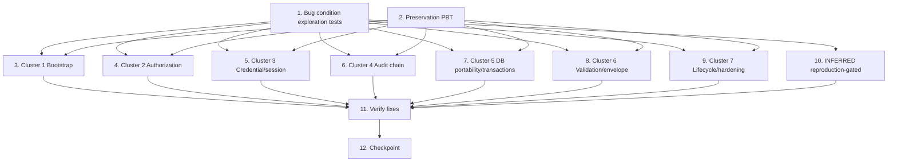

# Implementation Plan

## Overview

This plan remediates the 40 findings in `bugfix.md` (clauses 1.1–1.40) using the bug-condition
methodology from `design.md`. Tests are written BEFORE the fixes: Property 1 surfaces
counterexamples that prove each finding's bug condition `C(X)` (fix checking), and Property 2
captures the baseline `¬C(X)` behavior that must stay unchanged (preservation checking).

Implementation is grouped by the design's seven root-cause clusters and ordered by severity
(Critical → Important → Minor): Cluster 1 Bootstrap wiring, Cluster 2 Authorization,
Cluster 3 Credential/session lifecycle, Cluster 4 Audit-chain integrity, Cluster 5 DB
portability & transactions, Cluster 6 Validation & response shaping, Cluster 7 Resource
lifecycle & hardening, plus the [INFERRED] reproduction-gated fixes (1.23, 1.30). Clusters
are sequenced so the Critical-bearing ones come first. Tests live in the existing Vitest suite
under `src/__tests__`; run a single execution (e.g. `npm test` / `vitest --run`), never watch mode.

## Tasks

- [x] 1. Write bug condition exploration tests (BEFORE any fix)
  - **Property 1: Bug Condition** - Code-Review Findings Reproduce as Counterexamples
  - **CRITICAL**: These tests MUST FAIL on unfixed code - failure confirms each bug exists
  - **DO NOT attempt to fix the test or the code when it fails** - the failure is the goal here
  - **NOTE**: These tests encode the Expected Behavior (clauses 2.N) - they validate the fixes when they pass after implementation
  - **GOAL**: Surface concrete counterexamples for every finding `N` where `isBugCondition(input)` is true (design "Bug Condition")
  - **Scoped PBT Approach**: Each finding is deterministic, so scope the property to the concrete triggering case(s) for reproducibility; use generators only where an input family applies (e.g. random whitelisted columns, random TOTP windows)
  - Critical findings to reproduce (assert the defective outcome):
    - 1.1 Startup wiring: boot in test; assert `redisManager.connect()`, `queueManager.initialize()`, `setupWebSocket()`, `startAutomationJobs()`, `backupScheduler.start()`, queue workers, and `/metrics` are NOT invoked/mounted
    - 1.2 Graceful shutdown: send shutdown signal; assert queue drain / pg pool end / Redis disconnect / cron stop / `ApiServer.stop()` are NOT called
    - 1.3 Bulk authz: `POST /api/v1/bulk/:resource` as a permission-less user; assert it is NOT 403, writes restricted columns, and returns `id === undefined`
    - 1.4 Session revocation: change password, replay prior rotated refresh cookie; assert it still mints an access token
    - 1.5 Audit chain: write audit events via `RecommendationService`/`CoiService`/etc.; assert rows lack `hash`/`previous_hash`/`seq` and `logAudit` swallows append errors
  - Important findings to reproduce: 1.6 missing `checkPermission`; 1.7 IDOR on reports/comments/coi; 1.8 unauthenticated `/system-errors`+`/log-error`; 1.9 no 2FA rate limit; 1.10 TOTP replay accepted in-window; 1.11 missing encryption key silently ignored; 1.12 `DepartmentService.update` column injection; 1.13 multi-step writes without transaction; 1.14 webhook inside transaction; 1.15 validation factories not wired; 1.16 `requestLogger` unmounted; 1.17 double-wrapped envelope; 1.18 raw `err.message` leak; 1.19 non-atomic correspondence numbering; 1.20 risk whitelist rejects derived columns; 1.21 employee-id integer-cast failure; 1.22 org-entity conflict/self-parent guard; 1.24 `runMigrations` swallows DDL error; 1.25 Redis no recovery; 1.26 insecure compose defaults; 1.27 WS accepts any RS256 token via query string; 1.28 denies (`is_allowed=0`) ignored; 1.29 idempotency caches secrets
  - Minor findings to reproduce: 1.31 soft-delete leak; 1.32 hard-delete on soft-delete tables + wrong `SOFT_DELETE_TABLES` name; 1.33 unbounded queries; 1.34 CSV formula injection; 1.35 inconsistent pagination defaults; 1.36 `QueryBuilder.orderBy` no identifier validation; 1.37 CircuitBreaker retry/health logic; 1.38 leaked PDF timer + style interpolation; 1.39 cookie/HKDF/temp-password/sync-bcrypt/dead-policy; 1.40 misc hardening list
  - [INFERRED] 1.23 PDF-in-container and 1.30 file-upload middleware: reproduce in the container/runtime FIRST; record whether the defect manifests (these MAY PASS on unfixed code → close as "not reproducible" instead of fixing)
  - Run the tests on UNFIXED code
  - **EXPECTED OUTCOME**: Tests FAIL for confirmed findings (proves the bug exists); document each counterexample (e.g. "bulk create returns 200 + `id=undefined` for a user without `users:create`")
  - Mark complete when tests are written, run, and failures (or [INFERRED] reproduction results) are documented
  - _Requirements: 1.1, 1.2, 1.3, 1.4, 1.5, 1.6, 1.7, 1.8, 1.9, 1.10, 1.11, 1.12, 1.13, 1.14, 1.15, 1.16, 1.17, 1.18, 1.19, 1.20, 1.21, 1.22, 1.23, 1.24, 1.25, 1.26, 1.27, 1.28, 1.29, 1.30, 1.31, 1.32, 1.33, 1.34, 1.35, 1.36, 1.37, 1.38, 1.39, 1.40_

- [x] 2. Write preservation property tests (BEFORE implementing any fix)
  - **Property 2: Preservation** - Non-Triggering Behavior Is Unchanged
  - **IMPORTANT**: Follow observation-first methodology - record outputs from the UNFIXED code, then assert the fixed code matches
  - **Testing Approach**: Use property-based testing (fast-check + Vitest) since preservation is a universal claim over all `¬C(X)` inputs; generators catch edge cases manual tests miss
  - Observe and capture baseline on UNFIXED code for non-triggering inputs:
    - Authorized, whitelisted CRUD: generate authorized requests with permitted/whitelisted columns and roles; record responses + status codes (3.1, 3.2)
    - Session/2FA: generate still-valid non-revoked sessions and valid unused TOTP/backup codes within window; record acceptance (3.3, 3.4)
    - Audit: record correct, verifiable entries from already-compliant writers (3.5)
    - Boot: with all required config present, record successful boot + traffic serving (3.6)
    - Envelope/list: generate canonical-envelope success payloads and in-range pagination over non-deleted rows; record shape, status, result set, ordering (3.7, 3.8)
    - Webhook/identifier/migration: record persisted records for successful webhook ops and valid identifier inputs; record migration idempotency across restart (3.9, 3.10, 3.12)
    - Wired features: record designed PDF/notification/queue/cron/WebSocket outputs/payloads (3.11)
  - Write property-based tests asserting the fixed code reproduces these observed outputs across the input domain
  - Invariants to encode: rotated refresh tokens always carry `session_version`; reused TOTP codes always rejected; bulk routes always require permission; envelope shape stable across random success payloads
  - Run the tests on UNFIXED code
  - **EXPECTED OUTCOME**: Tests PASS (confirms the baseline `¬C(X)` behavior to preserve)
  - Mark complete when tests are written, run, and passing on unfixed code
  - _Requirements: 3.1, 3.2, 3.3, 3.4, 3.5, 3.6, 3.7, 3.8, 3.9, 3.10, 3.11, 3.12_

- [x] 3. Cluster 1 — Bootstrap wiring (Critical + Important)

  - [x] 3.1 Wire startup composition (1.1) and graceful shutdown (1.2)
    - In `src/index.ts start()`, invoke `redisManager.connect()`, `queueManager.initialize()`, `setupWebSocket()`, `startAutomationJobs()`, `backupScheduler.start()`, and the notification/PDF queue workers, and mount `/metrics` — or gate each behind explicit config flags
    - In `src/main.ts` / `src/server/gracefulShutdown.ts`, have the signal handler call `ApiServer.stop()` and drain `queueManager.shutdown()`, end the pg pool, disconnect Redis, and stop cron, all within the bounded `SHUTDOWN_DRAIN_TIMEOUT_MS`
    - _Bug_Condition: C_startupWiring (1.1), C_gracefulShutdown (1.2) from design_
    - _Expected_Behavior: expectedBehavior 2.1, 2.2 from design_
    - _Preservation: a fully-configured environment still boots/serves and drains (3.6, 3.11)_
    - _Requirements: 1.1, 1.2, 2.1, 2.2, 3.6, 3.11_

  - [x] 3.2 Mount request logging (1.16)
    - Mount `requestLogger.ts` in `index.ts` so `request_logs` are written and slow-request warnings fire
    - _Bug_Condition: C_requestLoggerUnmounted (1.16) from design_
    - _Expected_Behavior: expectedBehavior 2.16 from design_
    - _Requirements: 1.16, 2.16_

- [x] 4. Cluster 2 — Authorization (Critical + Important)

  - [x] 4.1 Enforce route permissions and bulk whitelist (1.3 authz, 1.6)
    - Add `checkPermission(resource, action)` to every listed mutating/custom route in `auditTasks.ts`, `auditPrograms.ts` (duplicate/approve), `recommendations.ts` (`GET /`, `PATCH /:id/resolve`), `correspondence.ts` (create/refer/archive/status/attachments), and `reports.ts` (`POST /generate`, `GET /:reportId/status`)
    - Run `checkWhitelist` in `BulkOperationsService.processCreate/processUpdate` to reject restricted columns
    - _Bug_Condition: C_bulkAuthz (1.3), C_routePermission (1.6) from design_
    - _Expected_Behavior: expectedBehavior 2.3, 2.6 from design_
    - _Preservation: authorized whitelisted CRUD still succeeds (3.1, 3.2)_
    - _Requirements: 1.3, 1.6, 2.3, 2.6, 3.1, 3.2_

  - [x] 4.2 Enforce object-level authorization / IDOR (1.7)
    - Add ownership/entitlement checks on `reports.ts GET /:reportId/status`, `comments.ts GET /:type/:id`, and `coi.ts GET /coi`
    - _Bug_Condition: C_objectLevelAuthz (1.7) from design_
    - _Expected_Behavior: expectedBehavior 2.7 from design_
    - _Requirements: 1.7, 2.7, 3.1_

  - [x] 4.3 Secure logging endpoints (1.8)
    - Require auth on `POST /system-errors` and `POST /log-error`, sanitize/escape + rate-limit broadcast/persisted content, gate `DELETE /system-errors` behind a delete/edit-level permission, and read the JWT public key from injected config (not `process.env` directly)
    - _Bug_Condition: C_unauthLogging (1.8) from design_
    - _Expected_Behavior: expectedBehavior 2.8 from design_
    - _Requirements: 1.8, 2.8_

  - [x] 4.4 Harden WebSocket handshake (1.27)
    - Require `type==='ws'`, re-check `session_version`/`status`, and accept the token via header/subprotocol instead of `?token=` query string
    - _Bug_Condition: C_wsTokenWeak (1.27) from design_
    - _Expected_Behavior: expectedBehavior 2.27 from design_
    - _Preservation: valid ws sessions still connect (3.4)_
    - _Requirements: 1.27, 2.27, 3.4_

  - [x] 4.5 Compute effective permissions with denies (1.28, 1.40 authz)
    - Subtract `is_allowed=0` denies in `/me` and `AuthService.login`; authorize `changeFindingStatus`/`approveProgram` against effective DB permissions (not the static `DEFAULT_PERMISSIONS` map)
    - _Bug_Condition: C_permissionDenyIgnored (1.28), C_miscHardening authz portion (1.40) from design_
    - _Expected_Behavior: expectedBehavior 2.28, 2.40 (permissions) from design_
    - _Requirements: 1.28, 1.40, 2.28, 2.40, 3.1_

- [x] 5. Cluster 3 — Credential / session lifecycle (Critical + Important)

  - [x] 5.1 Fix session revocation on password change (1.4)
    - Include `session_version` in rotated refresh tokens (`SessionService.refresh`); terminate `user_sessions` and revoke `refresh_tokens` in `PasswordService.changePassword/updatePassword` (matching `approveReset`)
    - _Bug_Condition: C_sessionRevocation (1.4) from design_
    - _Expected_Behavior: expectedBehavior 2.4 from design_
    - _Preservation: still-valid non-revoked sessions keep working (3.4)_
    - _Requirements: 1.4, 2.4, 3.4_

  - [x] 5.2 Add 2FA brute-force protection (1.9)
    - Apply rate limiting/lockout (comparable to `authLimiter`) to `/2fa/validate` and `/2fa/backup`
    - _Bug_Condition: C_2faBruteForce (1.9) from design_
    - _Expected_Behavior: expectedBehavior 2.9 from design_
    - _Preservation: valid unused 2FA codes still accepted (3.3)_
    - _Requirements: 1.9, 2.9, 3.3_

  - [x] 5.3 Reject TOTP replay (1.10)
    - Check `last_used_at` before accepting; fix the constant-time comparison so its result actually gates acceptance (no discarded result in `catch`)
    - _Bug_Condition: C_totpReplay (1.10) from design_
    - _Expected_Behavior: expectedBehavior 2.10 from design_
    - _Preservation: valid unused TOTP code within window still accepted (3.3)_
    - _Requirements: 1.10, 2.10, 3.3_

  - [x] 5.4 Assert encryption keys at startup (1.11)
    - Fail fast at startup if `FILE_ENCRYPTION_KEY`/`TOTP_ENCRYPTION_KEY` are missing (like `FILE_ACCESS_SECRET`), so files are never written plaintext
    - _Bug_Condition: C_missingEncryptionKey (1.11) from design_
    - _Expected_Behavior: expectedBehavior 2.11 from design_
    - _Preservation: configured environment still boots (3.6)_
    - _Requirements: 1.11, 2.11, 3.6_

  - [x] 5.5 Redact secrets from idempotency cache (1.29)
    - Omit/redact secrets (e.g. `tempPassword`) before caching; document cross-instance dedup as best-effort
    - _Bug_Condition: C_idempotencySecretCache (1.29) from design_
    - _Expected_Behavior: expectedBehavior 2.29 from design_
    - _Requirements: 1.29, 2.29_

  - [x] 5.6 Harden credential flows (1.39)
    - Environment-aware cookie `secure`/`sameSite` (rotate refresh cookie where appropriate), HKDF in `KeyStore`, higher-entropy `approveReset` temp passwords, async bcrypt, and remove/wire dead `validatePasswordPolicy`
    - _Bug_Condition: C_credentialFlowWeak (1.39) from design_
    - _Expected_Behavior: expectedBehavior 2.39 from design_
    - _Requirements: 1.39, 2.39, 3.4_

- [x] 6. Cluster 4 — Audit-chain integrity (Critical)

  - [x] 6.1 Centralize audit writes through AuditChainService (1.5)
    - Funnel all audit writes (`RecommendationService`, `CoiService`, `DepartmentService`, `JobTitleService`, `PolicyService`, `ProfileService`) through `AuditChainService`; add `hash`/`previous_hash`/`seq` to `database/schema.sql` and `PartitionManager` rebuild; make `BaseService.logAudit` surface (not swallow) append failures
    - _Bug_Condition: C_auditChain (1.5) from design_
    - _Expected_Behavior: expectedBehavior 2.5 from design_
    - _Preservation: already-compliant writers still produce verifiable chain entries (3.5)_
    - _Requirements: 1.5, 2.5, 3.5_

- [x] 7. Cluster 5 — DB portability & transaction boundaries (Critical + Important)

  - [x] 7.1 Make id reads, casts, and conflict detection portable (1.3 id, 1.21, 1.22)
    - Read new id via `RETURNING id` (not `info.lastInsertRowid`); fix employee-id generation to avoid the Postgres/PGlite invalid-integer cast and fix `getUserSummary` archived-status counting; detect unique-constraint conflicts portably (raise `ConflictError`), fix the `parseInt(uuid)` self-parent guard, and reconcile `OrgService`/`DepartmentService` delete semantics
    - _Bug_Condition: C_bulkAuthz id portion (1.3), C_employeeIdCast (1.21), C_orgEntityConflict (1.22) from design_
    - _Expected_Behavior: expectedBehavior 2.3 (id), 2.21, 2.22 from design_
    - _Preservation: valid identifier/org-entity ops produce same unique ids and records (3.10)_
    - _Requirements: 1.3, 1.21, 1.22, 2.3, 2.21, 2.22, 3.10_

  - [x] 7.2 Wrap multi-step writes in transactions (1.13)
    - Wrap `AuditService.changeFindingStatus`, `RecommendationService.update` (cascading auto-close), and `NotificationService.create` (per-recipient loop) in a single transaction
    - _Bug_Condition: C_missingTransaction (1.13) from design_
    - _Expected_Behavior: expectedBehavior 2.13 from design_
    - _Requirements: 1.13, 2.13, 3.2_

  - [x] 7.3 Move webhooks outside transactions (1.14)
    - Move n8n webhook calls in `AuditService.updateFinding`, `CorrespondenceService.updateStatus`, `UserService.createUser/updateUser` outside the transaction (after commit) with try/catch; dispatch `transactionalEvents.flushOnCommit` only after commit; enforce `FLUSH_DEADLINE_MS`
    - _Bug_Condition: C_webhookInTransaction (1.14) from design_
    - _Expected_Behavior: expectedBehavior 2.14 from design_
    - _Preservation: successful webhook ops still dispatch + persist (3.9)_
    - _Requirements: 1.14, 2.14, 3.9_

  - [x] 7.4 Use atomic numbering and fix risk whitelist (1.19, 1.20)
    - Replace `ORDER BY id DESC` numbering in `CorrespondenceService.createIncoming/createOutgoing` with `NumberingService.nextCounter` (UPSERT RETURNING); compute/whitelist `risk_score_calc`/`risk_level_calc` so `RiskService.create/update` passes `checkWhitelist`
    - _Bug_Condition: C_correspondenceNumbering (1.19), C_riskWhitelist (1.20) from design_
    - _Expected_Behavior: expectedBehavior 2.19, 2.20 from design_
    - _Preservation: valid numbering/risk inputs still produce correct unique records (3.10, 3.2)_
    - _Requirements: 1.19, 1.20, 2.19, 2.20, 3.2, 3.10_

  - [x] 7.5 Make migrations fail-fast and tracked (1.24)
    - Make `runMigrations()` throw on DDL error (stop startup), and reconcile the two overlapping migration systems into one tracked, versioned path
    - _Bug_Condition: C_migrationSwallow (1.24) from design_
    - _Expected_Behavior: expectedBehavior 2.24 from design_
    - _Preservation: already-applied migrations remain idempotent on restart (3.12)_
    - _Requirements: 1.24, 2.24, 3.12_

- [x] 8. Cluster 6 — Validation & response shaping (Important + Minor)

  - [x] 8.1 Wire validation and identifier checks (1.12, 1.15, 1.36)
    - Validate column identifiers in `DepartmentService.update` via `db.validateIdentifier`; import `src/schemas/*` + `validate.ts` factories into routes (query/params/body); enforce the `correspondence POST /attachments` schema (size/MIME/UUID); whitelist `crudGenerator GET` filter keys; validate identifiers in `QueryBuilder.orderBy` and parameterize role constants in `NotificationService.getAdminIds`/`fraud.ts`
    - _Bug_Condition: C_columnInjection (1.12), C_validationNotWired (1.15), C_orderByNoValidation (1.36) from design_
    - _Expected_Behavior: expectedBehavior 2.12, 2.15, 2.36 from design_
    - _Preservation: in-range valid list/query params return same result sets/ordering (3.8)_
    - _Requirements: 1.12, 1.15, 1.36, 2.12, 2.15, 2.36, 3.8_

  - [x] 8.2 Unify response envelope and sanitize errors (1.17, 1.18, 1.34)
    - Apply a single canonical envelope (no double-wrap, no `error.error` nesting) with one field-error shape; route manual errors in `auditTasks.ts`/`recommendations.ts`/`adminBackup.ts` through the global sanitizer (no raw `err.message`); neutralize leading `=`/`+`/`-`/`@` in `logs.ts /system-errors/export` CSV
    - _Bug_Condition: C_envelopeDoubleWrap (1.17), C_rawErrorLeak (1.18), C_csvInjection (1.34) from design_
    - _Expected_Behavior: expectedBehavior 2.17, 2.18, 2.34 from design_
    - _Preservation: canonical-envelope success responses keep same shape + status codes (3.7)_
    - _Requirements: 1.17, 1.18, 1.34, 2.17, 2.18, 2.34, 3.7_

- [x] 9. Cluster 7 — Resource lifecycle & operational hardening (Minor + Important)

  - [x] 9.1 Fix soft-delete handling and bound queries (1.31, 1.32, 1.33)
    - Add `deleted_at IS NULL` filters to the listed dashboard/task/recommendation/finding reads; soft-delete (not hard-delete) in `AuditService.deleteFinding` and `CorrespondenceService.deleteIncoming/deleteOutgoing` and fix `SOFT_DELETE_TABLES` to `outgoing_letters`; add pagination/limits to the listed unbounded list/export queries
    - _Bug_Condition: C_softDeleteLeak (1.31), C_hardDeleteOnSoftTable (1.32), C_unboundedQuery (1.33) from design_
    - _Expected_Behavior: expectedBehavior 2.31, 2.32, 2.33 from design_
    - _Preservation: in-range list queries on non-deleted rows return same sets/ordering modulo new filters/bounds (3.8)_
    - _Requirements: 1.31, 1.32, 1.33, 2.31, 2.32, 2.33, 3.8_

  - [x] 9.2 Fix operational/consistency items (1.25, 1.26, 1.35, 1.37, 1.38, 1.40)
    - Add Redis backoff recovery (1.25); remove insecure `docker-compose.yml` default secrets (1.26); unify pagination defaults across `pagination.ts`/`paginationService.ts`/`responseEnvelope.computePagination`/`schemas/crudFilters`/`BaseService.findAll` (1.35); fix `CircuitBreaker` (`isRetryableError`, 5xx handling, guarded HALF_OPEN re-entry) (1.37); clear `PdfEngine.timeout()` timer on race resolve and sanitize `pdfHelpers.wrapWithStyles` interpolation (1.38); apply the remaining 2.40 hardening list (caching, single `X-Request-Id`, partial PUT validation, plan-code consumption, health auth/shadowing, Winston logging, SSL in `dependencyCheck`, `/metrics` access control, `SettingsService` no-NULL-clobber)
    - _Bug_Condition: C_redisNoRecovery (1.25), C_insecureComposeDefaults (1.26), C_paginationInconsistent (1.35), C_circuitBreakerLogic (1.37), C_pdfTimerLeak (1.38), C_miscHardening (1.40) from design_
    - _Expected_Behavior: expectedBehavior 2.25, 2.26, 2.35, 2.37, 2.38, 2.40 from design_
    - _Preservation: in-range list results/ordering and configured boot unchanged (3.8, 3.6, 3.11)_
    - _Requirements: 1.25, 1.26, 1.35, 1.37, 1.38, 1.40, 2.25, 2.26, 2.35, 2.37, 2.38, 2.40, 3.6, 3.8, 3.11_

- [x] 10. [INFERRED] Reproduction-gated fixes (1.23, 1.30)

  - [x] 10.1 Reproduce and conditionally fix PDF-in-container and file-upload middleware
    - **GATE**: Use the reproduction results from task 1. Only change code if the defect is confirmed; otherwise close the clause as "not reproducible" (do NOT change behavior)
    - If 1.23 confirmed: provide a reachable Chromium binary + set `PUPPETEER_EXECUTABLE_PATH` with UID-1001 cache permissions in the `Dockerfile`
    - If 1.30 confirmed: register `app.use(fileUpload(...))` so `req.files` is parsed (after verifying it is not registered in an out-of-scope bootstrap file)
    - _Bug_Condition: C_pdfChromium (1.23) [INFERRED], C_fileUploadUnregistered (1.30) [INFERRED] from design_
    - _Expected_Behavior: expectedBehavior 2.23, 2.30 from design (gated on reproduction)_
    - _Preservation: configured PDF/upload features keep their designed outputs (3.11)_
    - _Requirements: 1.23, 1.30, 2.23, 2.30, 3.11_

- [x] 11. Verify all fixes (fix checking + preservation checking)

  - [x] 11.1 Verify bug condition exploration tests now pass
    - **Property 1: Expected Behavior** - Code-Review Findings Are Remediated
    - **IMPORTANT**: Re-run the SAME tests from task 1 - do NOT write new tests
    - The task-1 tests encode the expected behavior; when they pass they confirm clauses 2.N are satisfied
    - Run the bug condition exploration tests from task 1 against the fixed code
    - **EXPECTED OUTCOME**: Tests PASS for all confirmed findings (bug conditions can no longer trigger); [INFERRED] 1.23/1.30 pass or remain documented as "not reproducible"
    - _Requirements: 2.1, 2.2, 2.3, 2.4, 2.5, 2.6, 2.7, 2.8, 2.9, 2.10, 2.11, 2.12, 2.13, 2.14, 2.15, 2.16, 2.17, 2.18, 2.19, 2.20, 2.21, 2.22, 2.23, 2.24, 2.25, 2.26, 2.27, 2.28, 2.29, 2.30, 2.31, 2.32, 2.33, 2.34, 2.35, 2.36, 2.37, 2.38, 2.39, 2.40_

  - [x] 11.2 Verify preservation property tests still pass
    - **Property 2: Preservation** - Non-Triggering Behavior Is Unchanged
    - **IMPORTANT**: Re-run the SAME tests from task 2 - do NOT write new tests
    - Run the preservation property tests from task 2 against the fixed code
    - **EXPECTED OUTCOME**: Tests PASS (confirms no regressions for `¬C(X)` inputs)
    - _Requirements: 3.1, 3.2, 3.3, 3.4, 3.5, 3.6, 3.7, 3.8, 3.9, 3.10, 3.11, 3.12_

- [x] 12. Checkpoint - Ensure all tests pass
  - Run the full Vitest suite once (`npm test` / `vitest --run`, no watch mode)
  - Confirm every Property 1 exploration test passes and every Property 2 preservation test passes with no regressions
  - Confirm [INFERRED] findings (1.23, 1.30) are either fixed-and-passing or documented as "not reproducible"
  - Ensure all tests pass; ask the user if questions arise

## Task Dependency Graph



```json
{
  "waves": [
    { "wave": 1, "tasks": ["1", "2"] },
    { "wave": 2, "tasks": ["3", "4", "5", "6"] },
    { "wave": 3, "tasks": ["7", "8", "9", "10"] },
    { "wave": 4, "tasks": ["11"] },
    { "wave": 5, "tasks": ["12"] }
  ]
}
```

## Notes

- Tasks 1 and 2 are property-based tests (PBT) and MUST be written and run BEFORE any fix code: task 1 must FAIL for confirmed findings, task 2 must PASS, both on the unfixed code.
- Tasks 11.1 and 11.2 re-run the SAME tests from tasks 1 and 2 (no new tests). Their passing confirms fix checking and preservation checking respectively.
- Implementation is grouped by the design's seven root-cause clusters and sequenced by severity: Critical-bearing clusters (1 Bootstrap, 2 Authorization, 3 Credential/session, 4 Audit chain) run first (wave 2), followed by the remaining clusters and the [INFERRED] gate (wave 3).
- The two [INFERRED] findings (1.23 PDF-in-container, 1.30 file-upload middleware) MUST be reproduced first; if not reproducible, the clause is closed as "not reproducible" rather than changed.
- Each implementation sub-task carries `_Bug_Condition_`, `_Expected_Behavior_`, `_Preservation_`, and `_Requirements_` annotations referencing the matching design specifications and bugfix clauses.
- Run the project's test suite once (e.g. `npm test` / `vitest --run`) to avoid watch mode; the user should run any long-lived dev/build watchers manually.
