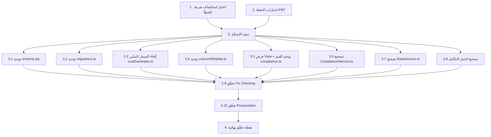

# Implementation Plan

## Overview

تتبع هذه الخطة منهجية شرط الخطأ (Bug Condition) الاستكشافية: نكتب اختبارات
**قبل** الإصلاح لإظهار العيوب (Exploratory Bug Condition Checking) وللتحقق من
حفظ السلوك السليم (Preservation Checking)، ثم ننفّذ مجموعات التغيير الثماني
الواردة في قسم Fix Implementation بالتصميم، ثم نتحقق من الإصلاح (Fix Checking)
وعدم التراجع (Regression). الملفات المتأثّرة: `database/schema.sql`،
`src/db/migrations.ts`، `src/utils/crudGenerator.ts`،
`src/services/columnWhitelist.ts`، `src/routes/compliance.ts`،
`src/services/ComplianceService.ts`، `src/services/BaseService.ts`،
`src/routes/__tests__/compliance.integration.test.ts`.

## Tasks

- [x] 1. كتابة اختبار استكشاف شرط الخطأ (قبل الإصلاح)
  - **Property 1: Bug Condition** - إظهار عيوب التناقض في مصفوفة الامتثال
  - **حرج**: يجب أن يفشل هذا الاختبار على الكود **غير المُصلَح** — والفشل يؤكّد وجود العيوب
  - **لا تحاول إصلاح الاختبار أو الكود عند فشله** — الفشل هو النتيجة المتوقّعة في هذه المرحلة
  - **ملاحظة**: يرمّز هذا الاختبار السلوك المتوقّع (Expected Behavior) وسيتحوّل إلى أداة تحقّق من الإصلاح لاحقاً عندما ينجح
  - **الهدف**: إظهار أمثلة مضادّة (Counterexamples) تُبرهن وجود كل فرع من فروع `isBugCondition(X)`
  - **نهج PBT المُوجَّه (Scoped)**: العيوب هنا حتمية، فتُوجَّه الخصائص إلى الحالات الفاشلة المحدّدة لضمان قابلية إعادة الإنتاج
  - تنفيذ حالات الاختبار التالية المشتقّة من قسم Exploratory Bug Condition Checking في التصميم:
    - انجراف المخطط (1.1): إنشاء قاعدة من `database/schema.sql` ثم استدعاء `ComplianceService.getAll` في `src/services/ComplianceService.ts` → يفشل لغياب `source_type`
    - حالة غير متّسقة (1.2): `PATCH /api/v1/compliance/:id/status` بقيمة `partial` عبر `src/routes/compliance.ts` على قاعدة من `schema.sql` → انتهاك قيد `CHECK`
    - المسار المكرر (1.3): التحقق من تسجيل كلٍّ من `/api/compliance-items` و`/api/v1/compliance` بسبب غياب `compliance-items` من `CRUD_EXCLUDED_ROUTES` في `src/utils/crudGenerator.ts` → وجود نقطتي وصول
    - عنصر غير موجود (1.6): `GET /api/v1/compliance/non-existent` → رمز 500 بدل 404 (بسبب `throw new Error('NOT_FOUND')` في `ComplianceService.getById`)
    - مُعرّف خاطئ (1.8): `BaseService.create` في `src/services/BaseService.ts` تحت PGlite → `result.id === undefined` (اعتماد `info.lastInsertRowid`)
    - قراءة غير محمية (1.5): مستخدم بلا صلاحية `View` يستدعي `GET /api/v1/compliance` → ينجح خطأً
    - حذف مكرّر (1.11): استدعاء `ComplianceService.softDelete` مرتين على العنصر نفسه → لا تقييد بـ `deleted_at IS NULL` ولا ضبط `deleted_by`
    - بحث بأحرف بدل (1.13): `ComplianceService.getAll({ search: '50%' })` → معاملة `%` كحرف بدل في `LIKE`
  - يجب أن تطابق توكيدات الاختبار خصائص السلوك المتوقّع (Properties 1-11) في التصميم
  - تشغيل الاختبار على الكود **غير المُصلَح**
  - **النتيجة المتوقّعة**: فشل الاختبار (وهذا صحيح — يُثبت وجود العيوب)
  - توثيق الأمثلة المضادّة المرصودة (مثل: «`getById('non-existent')` يُرجِع 500 بدل 404»، «`BaseService.create` يُرجِع `id = undefined`») لفهم الجذر
  - تُعتبر المهمة مكتملة عند كتابة الاختبار وتشغيله وتوثيق الفشل
  - _Requirements: 2.1, 2.2, 2.3, 2.4, 2.5, 2.6, 2.8, 2.11, 2.13_

- [x] 2. كتابة اختبارات الحفظ القائمة على الخصائص (قبل الإصلاح)
  - **Property 2: Preservation** - حفظ السلوك السليم القائم في مصفوفة الامتثال
  - **مهم**: اتّباع منهجية الرصد أولاً (Observation-First) — شغّل الكود **غير المُصلَح** أولاً، ارصد المخرجات الفعلية، ثم اكتب اختبارات تؤكّدها
  - **مهم**: استخدام الاختبار القائم على الخصائص (Property-Based Testing) لتوليد عدد كبير من الحالات عبر فضاء المدخلات وضمان أقوى للحفظ
  - رصد السلوك على الكود غير المُصلَح للمدخلات التي **لا** تحقّق `isBugCondition(X)`، وكتابة اختبارات تلتقطه، بناءً على قسم Preservation Checking في التصميم:
    - حفظ القيم الصالحة (3.1): رصد قبول `compliant`/`non_compliant`/`under_review` عبر `src/routes/compliance.ts` وكتابة خاصية تؤكّد قبولها
    - حفظ الإنشاء الصالح (3.2): `POST /api/v1/compliance` بـ `source_type` صحيح → 201 + مُعرّف العنصر
    - حفظ القراءة المُجمّعة (3.3): `ComplianceService.getById` لعنصر موجود يُرجِع `responsible_person_name` و`department_name`
    - حفظ التصفية (3.4): مرشحات `source_type`/`compliance_status`/`search` (بلا أحرف بدل) في `getAll` تُنتج النتائج نفسها
    - حفظ الرفض 403 (3.5): مستخدم بلا `Create`/`Edit`/`Delete` يُرفض كما هو الآن
    - حفظ شكل الملخّص (3.6): `ComplianceService.getSummary` يُرجِع `{counts, overdueReview, dueSoon}` بالقيم نفسها
    - حفظ `BaseService` لبقية الجداول (3.7): إنشاء/تحديث/حذف جداول أخرى عبر `src/services/BaseService.ts` دون تغيير، مع منع الإسناد الجماعي (Mass-Assignment) عبر `src/services/columnWhitelist.ts`
  - تشغيل الاختبارات على الكود **غير المُصلَح**
  - **النتيجة المتوقّعة**: نجاح الاختبارات (يؤكّد السلوك الأساس الواجب حفظه)
  - تُعتبر المهمة مكتملة عند كتابة الاختبارات وتشغيلها ونجاحها على الكود غير المُصلَح
  - _Requirements: 3.1, 3.2, 3.3, 3.4, 3.5, 3.6, 3.7_

- [x] 3. إصلاح تناقضات مصفوفة الامتثال (تنفيذ مجموعات التغيير الثماني)

  - [x] 3.1 توحيد المخطط المرجعي في `database/schema.sql`
    - إعادة تعريف `CREATE TABLE compliance_items` ليطابق `src/db/migrations.ts`: استبدال `type TEXT NOT NULL` بـ `source_type TEXT NOT NULL`، واستبدال `notes` بـ `gap_notes`
    - إضافة `category`, `review_date`, `maturity_score INTEGER CHECK(maturity_score BETWEEN 0 AND 100)`, `department_id UUID REFERENCES org_entities(id)`, `description`, `keywords`, `version`
    - تحويل `issue_date`/`effective_date`/`review_date` إلى `TEXT` مطابقةً للترحيل
    - توحيد قيد `compliance_status` إلى `CHECK (compliance_status IN ('compliant','non_compliant','under_review'))` وإسقاط `partial`/`partially_compliant`
    - الإبقاء على `deleted_by UUID REFERENCES users(id)`
    - _Bug_Condition: isBugCondition(X) حيث X.source = 'schema_recreate' AND X.schemaDefn ≠ X.migrationDefn_
    - _Expected_Behavior: singleSourceOfTruth(compliance_items) AND consistentStatusValues(X)_
    - _Preservation: قبول القيم الصالحة الموحّدة كما في Preservation Requirements_
    - _Requirements: 2.1, 2.2_

  - [x] 3.2 توحيد ترحيل وقت التشغيل في `src/db/migrations.ts`
    - إضافة قيد `CHECK` على `compliance_status` بالقيم الموحّدة `('compliant','non_compliant','under_review')`
    - إضافة العمود `deleted_by UUID REFERENCES users(id)` إلى تعريف `compliance_items` وإلى قائمة `addColumnIfNotExists`
    - توحيد `finding_compliance`: جعل `compliance_id` يشير إلى `compliance_items` وتطبيق `ON DELETE CASCADE` على `finding_id` بحيث يتطابق التعريفان بين `schema.sql` والترحيل
    - _Bug_Condition: isBugCondition(X) حيث (انجراف المخطط 1.1) OR (BaseService.create تحت Postgres/PGlite 1.8) OR (تعارض finding_compliance 1.10)_
    - _Expected_Behavior: singleSourceOfTruth(compliance_items) AND consistentJunctionDefinition()_
    - _Preservation: عمل BaseService لبقية الجداول دون تغيير_
    - _Requirements: 2.1, 2.2, 2.8, 2.10_

  - [x] 3.3 إلغاء المسار المكرر في `src/utils/crudGenerator.ts`
    - إضافة `'compliance-items'` إلى `CRUD_EXCLUDED_ROUTES` بحيث يتخطّى `generateRoutes("compliance_items","compliance-items","ComplianceMatrix")` التسجيل عبر الحارس الموجود
    - في حال الإبقاء مستقبلاً على أي مسار عام: تحديث `TABLE_ALLOWED_FIELDS['compliance_items']` لإزالة `type`/`notes` وإضافة `source_type` والأعمدة الفعلية (الحل المعتمد هنا هو الإلغاء)
    - _Bug_Condition: isBugCondition(X) حيث X.route = '/api/compliance-items'_
    - _Expected_Behavior: singleCanonicalRoute(compliance_items) AND writesOnlyExistingColumns(X)_
    - _Preservation: بقاء المسار المخصص `/api/v1/compliance` معتمداً_
    - _Requirements: 2.3, 2.4, 2.9_

  - [x] 3.4 توحيد قائمة الأعمدة في `src/services/columnWhitelist.ts`
    - تحديث مخطط `compliance_items` في `TABLE_WRITE_SCHEMAS`: استبدال `type`→`source_type` و`notes`→`gap_notes`
    - إضافة `category`, `review_date`, `maturity_score`, `department_id`, `description`, `keywords`, `version`
    - الإبقاء على عدم السماح بـ `created_by`/`deleted_by` للحفاظ على منع الإسناد الجماعي
    - _Bug_Condition: isBugCondition(X) حيث X.path = 'BaseService.write' AND (usesLegacyColumns(X) OR missing(X.source_type))_
    - _Expected_Behavior: writesOnlyExistingColumns(X)_
    - _Preservation: منع الإسناد الجماعي (Mass-Assignment) كما هو الآن — Requirement 3.7_
    - _Requirements: 2.4_

  - [x] 3.5 فرض صلاحية View وتوحيد قيم الحالة في `src/routes/compliance.ts`
    - إضافة `checkPermission('ComplianceMatrix','View')` إلى المسارات `GET /` و`GET /summary` و`GET /:id` (بعد `authenticate` وقبل `asyncHandler`)
    - تعديل `z.enum` في `itemSchema` ومصفوفة `allowed` في مسار `PATCH /:id/status` لإزالة `'partial'` واعتماد `['compliant','non_compliant','under_review']` فقط
    - تمرير `deletedBy = req.user.id` إلى استدعاء `softDelete`، وتمرير معاملي `page`/`pageSize` إلى `getAll`
    - _Bug_Condition: isBugCondition(X) حيث (GET على /api/v1/compliance بلا checksViewPermission 1.5) OR (compliance_status غير متّسقة 1.2)_
    - _Expected_Behavior: enforcesViewPermission(X) AND consistentStatusValues(X)_
    - _Preservation: رفض غير المخوّلين 403، وقبول القيم الصالحة الموحّدة — Requirements 3.1, 3.5_
    - _Requirements: 2.2, 2.5_

  - [x] 3.6 تصحيح طبقة الخدمة في `src/services/ComplianceService.ts`
    - استيراد `NotFoundError` من `../utils/errors` واستبدال `throw new Error('NOT_FOUND')` في `getById` بـ `throw new NotFoundError(...)`
    - `softDelete`: تقييد التحديث بـ `WHERE id = ? AND deleted_at IS NULL` وضبط `deleted_by = ?`، وإرجاع مؤشّر عدم وجود (أو رمي `NotFoundError`) عند عدم تأثّر أي صف
    - `getAll`: إضافة `page`/`pageSize` مع `LIMIT ? OFFSET ?`، وتهريب أحرف البدل في `search` (`%`→`\%`, `_`→`\_`) مع `ESCAPE '\'` في عبارات `LIKE`
    - `update`: السماح بالتصفير المقصود للحقول الاختيارية بدل `COALESCE` الذي يمنعه
    - _Bug_Condition: isBugCondition(X) حيث (getById لعنصر غير موجود 1.6) OR (softDelete 1.11) OR (getAll بلا ترقيم 1.12) OR (بحث بأحرف بدل 1.13)_
    - _Expected_Behavior: httpStatus(result)=404 للعنصر المفقود AND safeSoftDelete(result) AND supportsPagination(result) AND escapesLikeWildcards(X)_
    - _Preservation: إرجاع العناصر الموجودة بحقولها المُجمّعة، والتصفية الصحيحة، وشكل الملخّص — Requirements 3.3, 3.4, 3.6_
    - _Requirements: 2.6, 2.11, 2.12, 2.13_

  - [x] 3.7 تصحيح طبقة الأساس في `src/services/BaseService.ts`
    - في `create`: استبدال الإرجاع المعتمد على `info.lastInsertRowid` بـ `INSERT ... RETURNING id`، والحصول على `id` من الصف المُعاد (أسوةً بـ `update`/`delete` التي تستخدم `RETURNING` أصلاً)
    - ضمان أن `id` و`payload.id` للحدث المُخزّن (`enqueueEvent`) صحيحان وغير `undefined`
    - _Bug_Condition: isBugCondition(X) حيث X.path = 'BaseService.create' AND X.engine ∈ {Postgres, PGlite}_
    - _Expected_Behavior: definedEntityId(result)_
    - _Preservation: استمرار عمل BaseService.create/update/delete لبقية الجداول دون تغيير — Requirement 3.7_
    - _Requirements: 2.8_

  - [x] 3.8 تصحيح اختبار التكامل في `src/routes/__tests__/compliance.integration.test.ts`
    - تعديل تمويه `getSummary` ليُرجِع الشكل الفعلي `{ counts: [...], overdueReview: n, dueSoon: m }` وتعديل التوكيد المقابل
    - إضافة حالة اختبار 404 للعنصر غير الموجود (تموّه `getById` لترمي `NotFoundError`)
    - إضافة فرض صلاحية `View` على مسارات القراءة في إعداد الاختبار، والتحقق من تفرّد المسار المعتمد (عدم تسجيل `/api/compliance-items`)
    - _Bug_Condition: isBugCondition(X) حيث (اختبار يموّه السلوك الفعلي 1.7)_
    - _Expected_Behavior: testReflectsRealBehavior(X) AND consistentJunctionDefinition()_
    - _Preservation: شكل الملخّص `{counts, overdueReview, dueSoon}` — Requirement 3.6_
    - _Requirements: 2.7, 2.10_

  - [x] 3.9 التحقق من نجاح اختبار استكشاف شرط الخطأ بعد الإصلاح
    - **Property 1: Expected Behavior** - إظهار عيوب التناقض في مصفوفة الامتثال
    - **مهم**: أعد تشغيل **نفس** الاختبار من المهمة 1 — لا تكتب اختباراً جديداً
    - الاختبار من المهمة 1 يرمّز السلوك المتوقّع؛ نجاحه يؤكّد تحقّق Fix Checking لكل فروع شرط الخطأ
    - تشغيل اختبار استكشاف شرط الخطأ من الخطوة 1
    - **النتيجة المتوقّعة**: نجاح الاختبار (يؤكّد إصلاح العيوب)
    - _Requirements: 2.1, 2.2, 2.3, 2.4, 2.5, 2.6, 2.8, 2.11, 2.13_

  - [x] 3.10 التحقق من بقاء اختبارات الحفظ ناجحة بعد الإصلاح
    - **Property 2: Preservation** - حفظ السلوك السليم القائم في مصفوفة الامتثال
    - **مهم**: أعد تشغيل **نفس** الاختبارات من المهمة 2 — لا تكتب اختبارات جديدة
    - تشغيل اختبارات الحفظ القائمة على الخصائص من الخطوة 2
    - **النتيجة المتوقّعة**: نجاح الاختبارات (يؤكّد عدم وجود تراجع/Regression)
    - التأكّد من بقاء جميع الاختبارات ناجحة بعد الإصلاح
    - _Requirements: 3.1, 3.2, 3.3, 3.4, 3.5, 3.6, 3.7_

- [x] 4. نقطة تحقّق — ضمان نجاح كل الاختبارات
  - تشغيل مجموعة الاختبارات الكاملة (وحدة، قائمة على الخصائص، تكامل) والتأكّد من نجاحها جميعاً
  - التأكّد من نجاح اختبار شرط الخطأ (المهمة 1) واختبارات الحفظ (المهمة 2) معاً
  - التأكّد من عدم تسجيل المسار `/api/compliance-items` ووجود مسار واحد معتمد فقط
  - في حال ظهور أي إشكال، توقّف واسأل المستخدم

## Task Dependency Graph



```json
{
  "waves": [
    { "wave": 1, "tasks": ["1", "2"] },
    { "wave": 2, "tasks": ["3.1", "3.2", "3.3", "3.4", "3.5", "3.6", "3.7", "3.8"] },
    { "wave": 3, "tasks": ["3.9"] },
    { "wave": 4, "tasks": ["3.10"] },
    { "wave": 5, "tasks": ["4"] }
  ]
}
```

## Notes

- المهمتان 1 و2 اختباران قائمان على الخصائص (PBT) ويجب كتابتهما وتشغيلهما **قبل** أي تعديل على كود الإصلاح؛ المهمة 1 يجب أن تفشل والمهمة 2 يجب أن تنجح على الكود غير المُصلَح.
- المهمتان 3.9 و3.10 تعيدان تشغيل **نفس** اختبارات المهمتين 1 و2 دون كتابة اختبارات جديدة؛ نجاحهما يحقّق Fix Checking وPreservation Checking على الترتيب.
- مجموعات التغيير الثماني (3.1–3.8) مستقلّة نسبياً لكن تُكمل بعضها (توحيد القيم في `schema.sql` و`migrations.ts` و`compliance.ts` يجب أن يتطابق)، لذا تُنفَّذ معاً قبل التحقّق.
- القرار المعتمد لقيم `compliance_status` هو `('compliant','non_compliant','under_review')` مع إسقاط `partial`/`partially_compliant` عبر كل الطبقات.
- شغّل اختبارات المشروع يدوياً عبر الأمر المناسب (مثل `npm test -- --run`) لتجنّب وضع المراقبة (watch mode).
