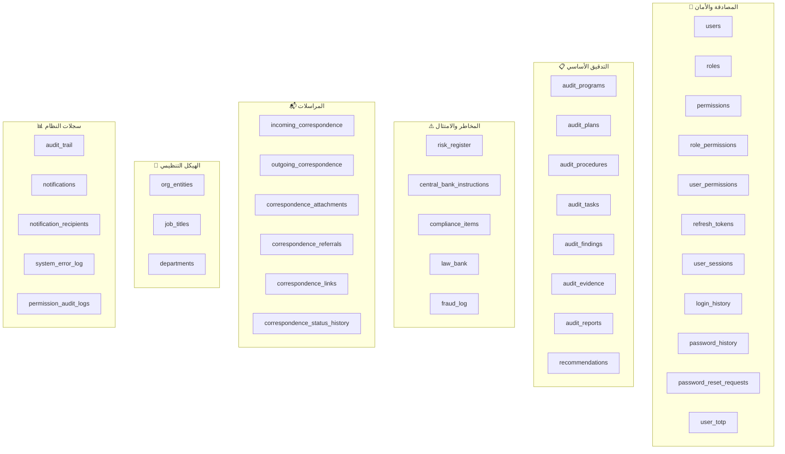

# التصميم التقني - مخطط قاعدة بيانات PostgreSQL لنظام الساقي

## نظرة عامة

هذا المستند يوثق التصميم الكامل لقاعدة بيانات PostgreSQL لنظام **الساقي** (ALSAQI) لإدارة التدقيق الداخلي. يشمل التصميم العالي المستوى (HLD) والتصميم المنخفض المستوى (LLD) مع جميع مراحل الإنشاء.

---

## 1. التصميم العالي المستوى (High-Level Design)

### 1.1 بنية النظام

```
┌─────────────────────────────────────────────────────────────┐
│                      Application Layer                        │
│              Express 5 + TypeScript + Zod                     │
└──────────────────────────┬──────────────────────────────────┘
                           │
                           ▼
┌─────────────────────────────────────────────────────────────┐
│                    Database Abstraction                       │
│           DBWrapper (pg.Pool | PGlite)                       │
│           ReadWriteLock + AsyncLocalStorage                   │
└──────────────────────────┬──────────────────────────────────┘
                           │
              ┌────────────┴────────────┐
              ▼                         ▼
┌──────────────────────┐    ┌──────────────────────┐
│  PostgreSQL (Prod)   │    │   PGlite (Dev/Test)  │
│  - SSL/TLS           │    │   - WASM-based       │
│  - Connection Pool   │    │   - File-persisted   │
│  - Partitioning      │    │   - Single-process   │
└──────────────────────┘    └──────────────────────┘
```

### 1.2 تنظيم الوحدات (Module Organization)



### 1.3 مخطط العلاقات (ER Diagram)

```mermaid
erDiagram
    users ||--o{ audit_tasks : "assigned_to"
    users ||--o{ audit_plans : "lead_auditor"
    users ||--o{ user_sessions : "has"
    users ||--o{ login_history : "has"
    users ||--o{ refresh_tokens : "has"
    users ||--o{ user_permissions : "has"
    users ||--o{ notification_recipients : "receives"
    users ||--o| user_totp : "has"
    
    roles ||--o{ role_permissions : "has"
    permissions ||--o{ role_permissions : "assigned_to"
    permissions ||--o{ user_permissions : "assigned_to"
    
    audit_programs ||--o{ audit_plans : "contains"
    audit_programs ||--o{ audit_procedures : "contains"
    audit_programs ||--o{ program_risk_links : "links"
    audit_programs ||--o{ program_compliance_links : "links"
    
    audit_plans ||--o{ audit_tasks : "contains"
    audit_plans ||--o{ audit_findings : "produces"
    audit_plans ||--o{ audit_reports : "generates"
    
    audit_tasks ||--o{ task_assignments : "assigned"
    
    audit_findings ||--o{ recommendations : "has"
    audit_findings ||--o{ audit_evidence : "supported_by"
    audit_findings ||--o{ finding_risks : "linked_to"
    audit_findings ||--o{ finding_compliance : "linked_to"
    
    risk_register ||--o{ finding_risks : "linked_to"
    risk_register ||--o{ program_risk_links : "linked_to"
    
    compliance_items ||--o{ program_compliance_links : "linked_to"
    central_bank_instructions ||--o{ finding_compliance : "linked_to"
    
    org_entities ||--o{ incoming_correspondence : "receives"
    org_entities ||--o{ outgoing_correspondence : "sends"
    org_entities ||--o{ correspondence_referrals : "referred_to"
    org_entities ||--o| org_entities : "parent"
    
    incoming_correspondence ||--o{ correspondence_attachments : "has"
    incoming_correspondence ||--o{ correspondence_referrals : "has"
    incoming_correspondence ||--o{ correspondence_links : "linked_to"
    outgoing_correspondence ||--o{ correspondence_attachments : "has"
    
    notifications ||--o{ notification_recipients : "delivered_to"
```



### 1.4 مراحل الإنشاء (Creation Phases)

| المرحلة | الوصف | الجداول |
|---------|-------|---------|
| **المرحلة 0** | إنشاء الامتدادات والأنواع | Extensions + Custom Types |
| **المرحلة 1** | الجداول الأساسية المستقلة | users, org_entities, departments |
| **المرحلة 2** | جداول التدقيق الأساسية | audit_programs, audit_plans, risk_register |
| **المرحلة 3** | الجداول المعتمدة | audit_tasks, audit_findings, compliance_items |
| **المرحلة 4** | جداول الربط | finding_risks, task_assignments, etc. |
| **المرحلة 5** | المراسلات | correspondence tables |
| **المرحلة 6** | النظام والأمان | audit_trail, sessions, tokens |
| **المرحلة 7** | الأرشفة والدعم | archived_*, backup_history |
| **المرحلة 8** | الفهارس والقيود | Indexes + Constraints |
| **المرحلة 9** | البيانات الأولية | Seed data |

---

## 2. التصميم المنخفض المستوى (Low-Level Design)

### 2.1 اتفاقيات التسمية (Naming Conventions)

| العنصر | الاتفاقية | مثال |
|--------|-----------|------|
| الجداول | snake_case, جمع | `audit_plans` |
| الأعمدة | snake_case | `created_at` |
| المفاتيح الأساسية | `id` (UUID) | `id UUID PRIMARY KEY` |
| المفاتيح الأجنبية | `{table_singular}_id` | `plan_id`, `user_id` |
| الفهارس | `idx_{table}_{column}` | `idx_users_username` |
| القيود الفريدة | `uq_{table}_{column}` | `uq_users_email` |
| CHECK constraints | `chk_{table}_{column}` | `chk_risk_score` |

### 2.2 المعايير العامة

- **UUID v4** كمفتاح أساسي لجميع الجداول (`gen_random_uuid()`)
- **Soft Delete** عبر `deleted_at TIMESTAMPTZ` + `deleted_by UUID`
- **Timestamps** موحدة: `created_at`, `updated_at` بنوع `TIMESTAMPTZ`
- **TEXT** بدلاً من VARCHAR (أفضل أداءً في PostgreSQL)
- **CHECK Constraints** للقيم المحددة بدلاً من ENUM types
- **Partial Indexes** للاستعلامات الشائعة على البيانات غير المحذوفة

### 2.3 استراتيجية الفهارس (Index Strategy)

| نوع الفهرس | الاستخدام | مثال |
|-------------|-----------|------|
| B-tree (default) | البحث والترتيب | الأعمدة العادية |
| Partial Index | تصفية soft-deleted | `WHERE deleted_at IS NULL` |
| Composite Index | استعلامات متعددة الأعمدة | `(user_id, status)` |
| GIN Index | بحث JSONB | `archived_plans.plan_data` |
| BRIN Index | بيانات زمنية مرتبة | `audit_trail.timestamp` |

### 2.4 ميزات PostgreSQL المستخدمة

- **Range Partitioning**: جدول `audit_trail` مقسم شهرياً
- **JSONB**: جداول الأرشفة لتخزين بيانات مرنة
- **CHECK Constraints**: التحقق من القيم المسموحة
- **Partial Unique Indexes**: فرض القيود الشرطية
- **ON DELETE CASCADE**: للجداول الفرعية
- **gen_random_uuid()**: إنشاء UUIDs بدون امتدادات إضافية

