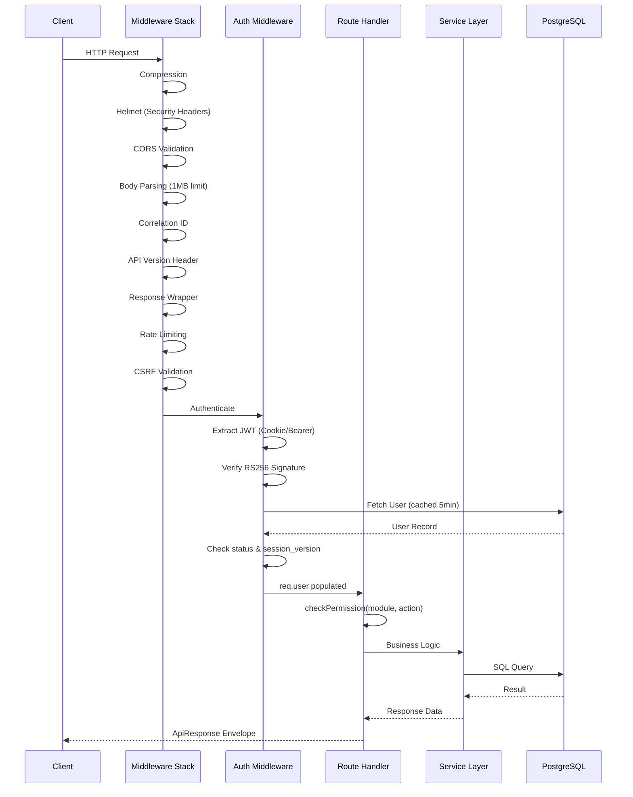
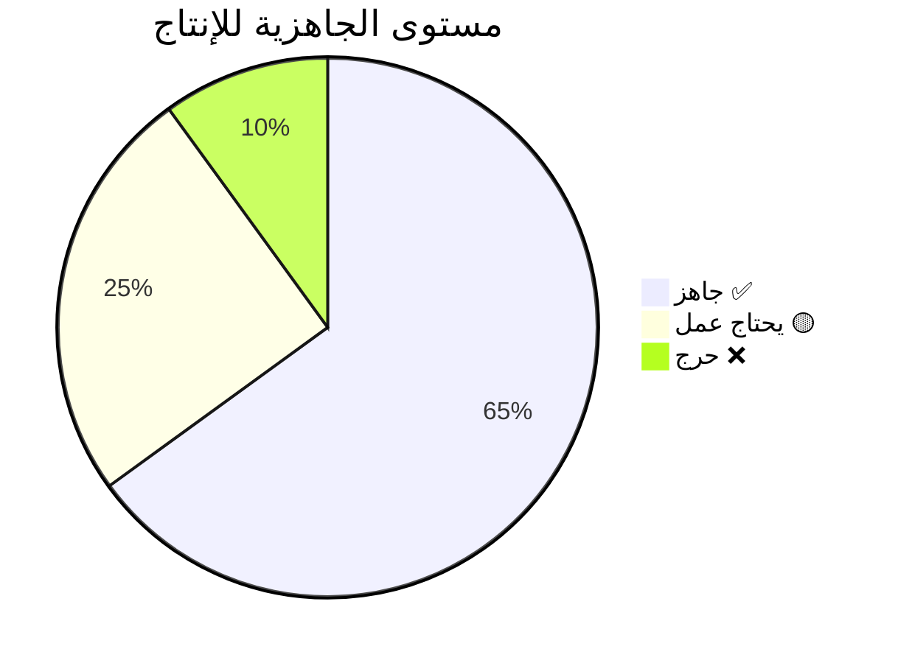

# وثيقة التصميم: تحليل جاهزية الإنتاج (Production Readiness Analysis)

## نظرة عامة

يقدم هذا التحليل تقييماً شاملاً لتطبيق **alsaqi-backend** لنظام إدارة التدقيق الداخلي من حيث جاهزيته لمرحلة الإنتاج. يغطي التحليل البنية التحتية، الأمان، قاعدة البيانات، المراقبة، الأداء، والممارسات التشغيلية. يحدد التقرير الديون التقنية الحالية، الفجوات الأمنية، والتحسينات المطلوبة قبل النشر الإنتاجي.

التطبيق مبني على Node.js/Express 5 مع TypeScript، يستخدم PostgreSQL كقاعدة بيانات إنتاجية مع PGlite كخيار للتطوير المحلي، ويتضمن نظام WebSocket للإشعارات الفورية، ونظام مهام مجدولة (Cron) للعمليات الآلية.

## الهيكلية العامة (Architecture)

```mermaid
graph TD
    Client[واجهة المستخدم - Frontend] -->|HTTPS/WSS| LB[Load Balancer]
    LB -->|HTTP| API[Express API Server]
    LB -->|WebSocket Upgrade| WS[WebSocket Server]
    
    API --> MW[Middleware Stack]
    MW --> Routes[V1 Router]
    Routes --> Services[Service Layer]
    Services --> DB[(PostgreSQL)]
    Services --> FS[File System - uploads/]
    Services --> N8N[n8n Automation]
    
    WS --> Auth[JWT Authentication]
    WS --> Notify[Real-time Notifications]
    
    API --> Cron[Scheduled Jobs]
    Cron --> DB
    Cron --> Notify
    
    API --> Backup[Backup Scheduler]
    Backup --> DB
    
    subgraph Security Layer
        Helmet[Helmet Headers]
        CORS[CORS Policy]
        CSRF[CSRF Protection]
        RateLimit[Rate Limiting]
        JWT[RSA JWT Auth]
    end
    
    MW --> Security Layer
```

## مخطط تسلسل تدفق الطلب (Request Lifecycle)



## المكونات والواجهات (Components & Interfaces)

### المكون 1: طبقة قاعدة البيانات (Database Layer)

**الغرض**: إدارة الاتصال بقاعدة البيانات مع دعم PostgreSQL الخارجي و PGlite المضمن

```typescript
interface IDBWrapper {
  readonly client: any;
  readonly isExternal: boolean;
  validateIdentifier(id: string): string;
  prepare(sql: string): {
    get(...params: any[]): Promise<any>;
    all(...params: any[]): Promise<any[]>;
    run(...params: any[]): Promise<{ lastInsertRowid: number; changes: number }>;
  };
  transaction<T>(fn: () => Promise<T>): Promise<T>;
  exec(sql: string): Promise<void>;
  updateClient(client: any, isExternal: boolean): void;
}
```

**المسؤوليات**:
- إدارة Connection Pool (max: 20, idle timeout: 30s)
- ReadWriteLock للحماية في وضع PGlite
- إعادة المحاولة التلقائية (retry) عند فشل WASM
- إدارة SSL في الإنتاج

### المكون 2: طبقة المصادقة (Authentication Layer)

**الغرض**: JWT RS256 مع دعم cookie و Bearer header

```typescript
interface AuthMiddlewares {
  authenticate: (req: any, res: any, next: any) => Promise<void>;
  checkPermission: (module: string, action: PermissionAction) => Middleware;
  authorize: (allowedRoles: readonly string[]) => Middleware; // deprecated
  authLimiter: RateLimitMiddleware;
}
```

**المسؤوليات**:
- التحقق من JWT RS256
- التحقق من حالة المستخدم وإصدار الجلسة
- Cache في الذاكرة (5 دقائق، حد أقصى 1000 مدخل)
- فحص الصلاحيات عبر PermissionService

### المكون 3: نظام الإشعارات الفورية (WebSocket)

**الغرض**: تسليم الإشعارات الفورية خلال ثانيتين

```typescript
interface WsSetupOptions {
  httpServer: HttpServer;
  wss: WebSocketServer;
  jwtPublicKey: string;
  logger?: Logger;
}
```

**المسؤوليات**:
- مصادقة JWT عبر query parameter
- Heartbeat كل 30 ثانية مع timeout 10 ثوانٍ
- بث الإشعارات للمستخدمين المحددين

### المكون 4: نظام المراقبة الصحية (Health Check)

**الغرض**: فحص شامل لكل الأنظمة الفرعية

```typescript
interface HealthStatus {
  status: 'healthy' | 'degraded' | 'unhealthy';
  checks: {
    database: SubsystemCheck;
    filesystem: SubsystemCheck;
    memory: SubsystemCheck;
    websocket: SubsystemCheck;
    cron: SubsystemCheck;
  };
  uptime: number;
  version: string;
}
```

## نماذج البيانات (Data Models)

### قاعدة البيانات - إحصائيات

| المقياس | القيمة |
|---------|--------|
| عدد الجداول | 63 |
| المفتاح الأساسي | UUID v4 |
| الترميز | UTF-8 |
| محرك قاعدة البيانات | PostgreSQL 15+ |
| Partitioning | audit_trail (شهري) |
| Soft Delete | جميع الجداول الرئيسية |
| Computed Columns | risk_score_calc, risk_level_calc |

### نظام الصلاحيات

```typescript
// RBAC مع تجاوز مستوى المستخدم
type PermissionModel = {
  roles: Role[];              // أدوار مع صلاحيات
  role_permissions: RolePermission[];  // ربط دور ← صلاحية
  user_permissions: UserPermission[];  // تجاوز مخصص لمستخدم
};
```

---

## تحليل الجاهزية للإنتاج

### ✅ النقاط الإيجابية (ما هو جاهز)

```mermaid
graph LR
    subgraph "جاهز للإنتاج ✅"
        A[JWT RS256 Authentication]
        B[RBAC + User Overrides]
        C[Rate Limiting]
        D[CSRF Protection]
        E[Helmet Security Headers]
        F[CORS Configuration]
        G[Graceful Shutdown]
        H[Health Check Endpoint]
        I[Structured Logging - Winston]
        J[API Versioning - v1]
        K[Error Sanitization in Production]
        L[SSL/TLS for DB]
        M[Secrets Validation]
        N[Soft Delete Pattern]
        O[Audit Trail - Partitioned]
        P[Backup Scheduler]
        Q[Correlation ID Tracing]
        R[Idempotency Middleware]
        S[Circuit Breaker - n8n]
        T[Session Version Invalidation]
        U[2FA - TOTP Support]
        V[File Encryption - AES-256-GCM]
        W[Docker Multi-stage Build]
        X[WebSocket with JWT Auth]
    end
```



---

### ❌ الديون التقنية والفجوات (Technical Debts & Gaps)

## الفجوة 1: اعتماد PGlite كـ Fallback في الإنتاج (Critical)

**المشكلة**: عند فشل الاتصال بـ PostgreSQL في الإنتاج، يُستخدم PGlite كبديل:

```typescript
// src/db/index.ts - خط 122
} catch (err: any) {
  console.error("[DB] External PostgreSQL connection failed. Falling back to PGlite.", err.message);
  const pgliteClient = createPgliteClient();
  db.updateClient(pgliteClient, false);
}
```

**الخطورة**: حرجة 🔴  
**التأثير**: 
- فقدان البيانات عند إعادة التشغيل (PGlite يستخدم /tmp)
- عدم توافق مع الميزات المتقدمة (Partitioning, Generated Columns)
- أداء ضعيف جداً مع ReadWriteLock

**التوصية**:
```typescript
// يجب أن يفشل الخادم في الإنتاج بدلاً من الانتقال لـ PGlite
if (process.env.NODE_ENV === 'production') {
  console.error("[DB] FATAL: Cannot connect to PostgreSQL in production.");
  process.exit(1);
}
```

---

## الفجوة 2: غياب Redis لإدارة الجلسات والتخزين المؤقت (High)

**المشكلة**: التخزين المؤقت يعتمد على ذاكرة العملية:

```typescript
// src/middleware/auth.ts
const cache = new Map<string, { data: any, expires: number }>();
// TODO: For multi-instance deployments, replace with Redis
```

**الخطورة**: عالية 🟠  
**التأثير**:
- عدم القدرة على تشغيل أكثر من instance واحد
- فقدان Cache عند إعادة التشغيل
- Rate Limiter يعمل per-instance فقط
- عدم مشاركة حالة الجلسات بين النسخ

**التوصية**:
- استخدام Redis (ioredis موجود بالفعل في dependencies)
- نقل Rate Limiter store لـ Redis
- نقل Permission Cache لـ Redis
- مشاركة CSRF tokens عبر Redis

---

## الفجوة 3: غياب نظام هجرة قاعدة البيانات المتقدم (High)

**المشكلة**: الهجرات تعتمد على `CREATE TABLE IF NOT EXISTS` مع versionedMigrations بسيطة

**الخطورة**: عالية 🟠  
**التأثير**:
- صعوبة التراجع عن التغييرات (no rollback)
- عدم وجود آلية لـ zero-downtime migrations
- لا يوجد migration locking للنشر المتزامن

**التوصية**:
- اعتماد أداة هجرة متخصصة (مثل node-pg-migrate أو Flyway)
- إضافة rollback scripts لكل migration
- تطبيق advisory locks لمنع الهجرات المتزامنة

---

## الفجوة 4: عدم اكتمال نظام المراقبة (Medium-High)

**المشكلة**: لا يوجد:
- APM (Application Performance Monitoring)
- Metrics export (Prometheus/OpenTelemetry)
- Alerting system
- Distributed tracing (correlation ID موجود لكن بدون backend)

**الخطورة**: متوسطة-عالية 🟡  
**التأثير**:
- صعوبة تشخيص مشاكل الأداء
- عدم القدرة على رصد المشاكل قبل تأثيرها على المستخدمين
- لا يوجد dashboard لحالة النظام

**التوصية**:
```typescript
// إضافة OpenTelemetry
import { NodeSDK } from '@opentelemetry/sdk-node';
import { PrometheusExporter } from '@opentelemetry/exporter-prometheus';

// Metrics: response time, error rate, DB query duration, queue depth
// Traces: request lifecycle, DB operations, external calls
```

---

## الفجوة 5: عدم وجود Queue System حقيقي (Medium)

**المشكلة**: BullMQ موجود في dependencies لكن لا يوجد استخدام فعلي:

```json
"bullmq": "^5.78.0"  // في package.json
```

**الخطورة**: متوسطة 🟡  
**التأثير**:
- الإشعارات تُرسل بشكل متزامن (synchronous)
- عمليات PDF تتم ضمن request cycle
- عمليات البريد الإلكتروني ستُفقد عند فشل الطلب

**التوصية**:
- تفعيل BullMQ مع Redis
- نقل إرسال الإشعارات لـ Queue
- نقل توليد PDF لـ Background Job
- نقل عمليات الأرشفة الكبيرة لـ Queue

---

## الفجوة 6: غياب CI/CD Pipeline (Medium)

**المشكلة**: لا يوجد أي ملف تكوين لـ:
- GitHub Actions / GitLab CI
- تشغيل الاختبارات تلقائياً
- فحص الأمان (SAST/DAST)
- بناء ونشر Docker تلقائياً

**الخطورة**: متوسطة 🟡  
**التوصية**:
```yaml
# .github/workflows/ci.yml
- npm run typecheck
- npm run test
- npm audit --audit-level=high
- docker build & push
- deploy to staging → production
```

---

## الفجوة 7: عدم وجود تكوين Container Orchestration (Medium)

**المشكلة**: Dockerfile موجود لكن لا يوجد:
- docker-compose.yml للتطوير المحلي
- Kubernetes manifests أو Cloud Run config
- Service mesh configuration
- Auto-scaling rules

**الخطورة**: متوسطة 🟡  
**التوصية**:
```yaml
# docker-compose.yml
services:
  api:
    build: .
    depends_on: [postgres, redis]
    environment: [...]
    deploy:
      replicas: 2
      resources:
        limits: { memory: 512M }
  postgres:
    image: postgres:15
  redis:
    image: redis:7-alpine
```

---

## الفجوة 8: اختلاف بين Dockerfile وهيكل المشروع الفعلي (Medium)

**المشكلة**: Dockerfile يشير لـ `packages/api` بينما الكود موجود في `src/`:

```dockerfile
COPY packages/api/package.json ./packages/api/
RUN npm run build --workspace=@alsaqi/api
CMD ["node", "packages/api/dist/server.js"]
```

بينما `package.json` الجذري يحتوي:
```json
"build": "esbuild src/main.ts --bundle --platform=node..."
```

**الخطورة**: متوسطة 🟡  
**التأثير**: Dockerfile لن يعمل بالشكل الصحيح مع الهيكل الحالي  
**التوصية**: تحديث Dockerfile ليتوافق مع هيكل المشروع الحالي

---

## الفجوة 9: غياب Rate Limiting متقدم (Medium)

**المشكلة**: Rate Limiting الحالي بسيط (per-IP في الذاكرة):

```typescript
createRateLimiter({
  authenticatedLimit: 100,
  unauthenticatedLimit: 50,
  windowSeconds: 60,
});
```

**الخطورة**: متوسطة 🟡  
**التأثير**:
- لا يعمل بشكل صحيح خلف Load Balancer (يحتاج X-Forwarded-For trust)
- لا يوجد حماية per-endpoint (بعض الـ endpoints أثقل من غيرها)
- لا يوجد adaptive rate limiting

**التوصية**:
- استخدام Redis-backed rate limiter
- إضافة حدود مخصصة لكل endpoint حسب الحمل
- إضافة trust proxy configuration

---

## الفجوة 10: عدم وجود إعداد HTTPS/TLS على مستوى التطبيق (Low-Medium)

**المشكلة**: التطبيق يستمع على HTTP فقط:

```typescript
server.listen(config.port, '0.0.0.0');
```

**الخطورة**: منخفضة-متوسطة  
**التوصية**: 
- في Cloud Run/K8s: TLS يُدار بواسطة Load Balancer (مقبول)
- التأكد من `trust proxy` مفعل في Express
- إضافة HSTS header (Helmet يتولى ذلك)

---

## الفجوة 11: غياب نظام تسجيل مركزي (Log Aggregation) (Medium)

**المشكلة**: Winston يكتب على Console فقط:

```typescript
transports: [
  new winston.transports.Console({...})
]
```

**الخطورة**: متوسطة 🟡  
**التوصية**:
- إضافة transport لخدمة مركزية (CloudWatch, ELK, Datadog)
- إضافة winston-daily-rotate-file (موجود في dependencies لكن غير مفعل)
- تكوين log levels مختلفة per-module

---

## الفجوة 12: عدم تكامل اختبارات الأمان (Medium)

**المشكلة**: لا يوجد:
- Dependency vulnerability scanning (npm audit automation)
- SAST (Static Application Security Testing)
- Secret scanning
- Container image scanning

**الخطورة**: متوسطة 🟡  
**التوصية**:
- إضافة `npm audit` في CI pipeline
- استخدام Snyk أو Trivy لفحص Docker images
- إضافة git pre-commit hooks لمنع تسريب secrets

---

## الفجوة 13: Puppeteer في الإنتاج (Medium)

**المشكلة**: استخدام Puppeteer لتوليد PDF:

```json
"puppeteer": "^25.1.0"
```

**الخطورة**: متوسطة 🟡  
**التأثير**:
- استهلاك عالي للذاكرة (headless Chrome)
- Docker image حجمه كبير
- مشاكل أمنية محتملة (Chrome sandbox)
- BrowserPool موجود لكن يحتاج tuning

**التوصية**:
- استخدام BrowserPool مع حد أقصى صارم (2-3 instances)
- تنفيذ PDF generation كـ background job
- النظر في بديل أخف (PDFKit, wkhtmltopdf)
- إضافة `--no-sandbox` flag فقط في Docker مع user غير root

---

## الفجوة 14: غياب Environment-specific Configuration (Low)

**المشكلة**: `.env.example` لا يوضح كل المتغيرات المطلوبة للإنتاج:

```env
# مطلوب في الإنتاج لكن غير موثق:
# VITE_STORAGE_SECRET
# VITE_NETWORK_SECRET  
# FILE_ENCRYPTION_KEY
# DB_SSL_CA_PATH
# DATA_DIR
# N8N_WEBHOOK_URL
# REDIS_URL (لـ BullMQ)
```

**التوصية**: إنشاء `.env.production.example` مع كل المتغيرات المطلوبة

---

## الفجوة 15: عدم وجود Connection Pool Monitoring (Low)

**المشكلة**: pg.Pool مكون بـ max: 20 لكن بدون مراقبة:

```typescript
client = new pg.Pool({
  connectionString: DATABASE_URL,
  max: 20,
  idleTimeoutMillis: 30000,
});
```

**التوصية**:
- إضافة pool event listeners (error, connect, remove)
- تصدير pool metrics (available, waiting, total)
- إضافة alerting عند امتلاء الـ pool

---

## خصائص الصحة (Correctness Properties)

*الخاصية هي سلوك أو صفة يجب أن تظل صحيحة عبر جميع عمليات التنفيذ الصالحة للنظام - أي عبارة رسمية حول ما يجب أن يفعله النظام. تعمل الخصائص كجسر بين المواصفات المقروءة بشرياً وضمانات الصحة القابلة للتحقق آلياً.*

### الخاصية 1: منع PGlite في بيئة الإنتاج (Production DB Fail-Fast)

*لأي* تهيئة يكون فيها NODE_ENV يساوي production ويفشل الاتصال بـ PostgreSQL (لأي سبب: timeout، رفض اتصال، بيانات خاطئة)، يجب أن ينهي الخادم العملية بكود خروج غير صفري ولا يُهيئ PGlite أبداً.

**Validates: Requirements 1.1, 1.2, 1.4**

### الخاصية 2: مدة صلاحية التخزين المؤقت (Cache TTL Bound)

*لأي* مدخل يُخزن مؤقتاً في مدير_التخزين_المؤقت لبيانات المصادقة، يجب أن تكون مدة صلاحيته (TTL) أقل من أو تساوي 300 ثانية (5 دقائق).

**Validates: Requirement 2.2**

### الخاصية 3: التدهور الأنيق عند فقدان Redis (Graceful Redis Degradation)

*لأي* عملية نظام تحدث أثناء انقطاع اتصال Redis، يجب أن يستمر النظام بمعالجة الطلبات بنجاح (بدون تخزين مؤقت) مع تسجيل تحذير.

**Validates: Requirement 2.4**

### الخاصية 4: ذرية الهجرات (Migration Atomicity)

*لأي* هجرة قاعدة بيانات تفشل أثناء التنفيذ في أي نقطة، يجب أن تبقى حالة قاعدة البيانات مطابقة لحالتها قبل بدء الهجرة (round-trip: الحالة قبل = الحالة بعد الفشل).

**Validates: Requirements 3.1, 3.2**

### الخاصية 5: سجل الهجرات (Migration Audit Trail)

*لأي* هجرة تُنفذ بنجاح، يجب أن يحتوي جدول سجل الهجرات على مدخل يتضمن اسم الهجرة وتاريخ التنفيذ وحالة "completed".

**Validates: Requirement 3.4**

### الخاصية 6: عكسية الهجرات (Migration Rollback Round-Trip)

*لأي* هجرة لها سكريبت تراجع، تطبيق الهجرة ثم تنفيذ التراجع يجب أن يعيد مخطط قاعدة البيانات إلى حالته الأصلية.

**Validates: Requirement 3.5**

### الخاصية 7: تسجيل استعلامات بطيئة (Slow Query Detection)

*لأي* استعلام قاعدة بيانات يستغرق أكثر من 500 ملي ثانية، يجب أن يظهر في سجل الاستعلامات البطيئة مع نص الاستعلام ومدته الفعلية.

**Validates: Requirement 4.3**

### الخاصية 8: اكتمال مقاييس الطلبات (Request Metrics Completeness)

*لأي* طلب HTTP يُعالج بواسطة النظام، يجب أن يسجل نظام_المراقبة مدة الاستجابة وكود الحالة ومسار الطلب، وعند حدوث خطأ يجب أن يزيد عداد الأخطاء مصنفاً حسب النوع والمسار.

**Validates: Requirements 4.2, 4.5**

### الخاصية 9: المعالجة غير المتزامنة للمهام (Async Job Processing)

*لأي* طلب توليد PDF أو إرسال إشعار، يجب أن يُضاف إلى الطابور المناسب ويُعاد معرف المهمة فوراً بدون انتظار اكتمال المعالجة.

**Validates: Requirements 5.1, 5.2, 13.3**

### الخاصية 10: إعادة محاولة المهام الفاشلة (Failed Job Retry with Backoff)

*لأي* مهمة في الطابور تفشل، يجب أن تُعاد محاولة تنفيذها حتى 3 مرات بفواصل زمنية تصاعدية (كل محاولة تالية تنتظر أطول من سابقتها).

**Validates: Requirement 5.3**

### الخاصية 11: حد التزامن في الطوابير (Queue Concurrency Bound)

*لأي* نوع طابور في أي لحظة، يجب ألا يتجاوز عدد المهام المنفذة بالتزامن الحد الأقصى المحدد لذلك النوع. على وجه الخصوص، لا يتجاوز عدد مثيلات المتصفح المتزامنة 3.

**Validates: Requirements 5.5, 13.1**

### الخاصية 12: استخراج IP الحقيقي (Real IP Extraction)

*لأي* طلب يحمل ترويسة X-Forwarded-For، يجب أن يستخرج محدد_المعدل عنوان IP الحقيقي للعميل (أول IP في السلسلة) ويستخدمه لتطبيق الحدود.

**Validates: Requirement 8.1**

### الخاصية 13: حدود مخصصة لكل نقطة نهاية (Per-Endpoint Rate Limits)

*لأي* نقطة نهاية لها حد مخصص محدد في التكوين، يجب أن يطبق محدد_المعدل ذلك الحد المخصص بدلاً من الحد الافتراضي.

**Validates: Requirement 8.3**

### الخاصية 14: استجابة تجاوز الحد (Rate Limit Exceeded Response)

*لأي* عميل يتجاوز الحد المسموح لنقطة نهاية ما، يجب أن تكون الاستجابة بكود 429 وتتضمن ترويسة Retry-After بقيمة رقمية موجبة.

**Validates: Requirement 8.4**

### الخاصية 15: تنسيق السجلات المنظم (Structured Log Format)

*لأي* سجل يُكتب في بيئة الإنتاج، يجب أن يكون بتنسيق JSON صالح يتضمن الحقول: timestamp, correlation_id, level, message.

**Validates: Requirements 9.1, 9.3**

### الخاصية 16: تصفية مستوى السجلات (Log Level Filtering)

*لأي* مستوى تسجيل مُكوّن (مثلاً warn)، يجب ألا تُصدر رسائل بمستوى أدنى (مثلاً info, debug) ويجب أن تُصدر رسائل بمستوى مساوٍ أو أعلى (warn, error, fatal).

**Validates: Requirement 9.4**

### الخاصية 17: التحقق من متغيرات البيئة (Environment Variable Validation)

*لأي* مجموعة فرعية من متغيرات البيئة المطلوبة حيث يغيب متغير واحد على الأقل، يجب أن يرفض الخادم البدء ويعرض رسالة خطأ تحدد المتغير المفقود بالاسم.

**Validates: Requirement 11.2**

### الخاصية 18: تحذير استنزاف Pool (Pool Exhaustion Warning)

*لأي* حالة يتجاوز فيها عدد الاتصالات المنتظرة 50% من الحد الأقصى للـ Pool، يجب أن يسجل نظام_المراقبة تحذيراً.

**Validates: Requirement 12.3**

### الخاصية 19: استعادة Pool بعد تعطل المتصفح (Browser Pool Recovery)

*لأي* حدث تعطل (crash) لمثيل متصفح، يجب أن يُزال المثيل من الـ Pool ويُنشأ بديل جديد، بحيث يبقى الـ Pool قادراً على معالجة مهام جديدة.

**Validates: Requirement 13.4**

### الخاصية 20: اتساق cursor-based pagination

*لأي* مجموعة بيانات وأي cursor صالح، يجب أن تكون النتائج المعادة متسقة ولا تتضمن تكرارات أو فقدان سجلات بين الصفحات المتتالية.

**Validates: Requirement 14.2**

### الخاصية 21: حالة Health Check (Health Status Correctness)

*لأي* مجموعة من حالات الأنظمة الفرعية، إذا كان أي نظام أساسي (database, redis) غير متاح يجب أن تكون الحالة unhealthy مع كود 503، وإذا كانت جميع الأنظمة الأساسية متاحة مع تعطل نظام ثانوي يجب أن تكون الحالة degraded مع كود 200.

**Validates: Requirements 15.2, 15.3**

### الخاصية 22: جاهزية التبعيات قبل قبول الطلبات (Dependency Readiness)

*لأي* تسلسل بدء تشغيل، يجب ألا يقبل النظام طلبات HTTP حتى تُؤكد جاهزية PostgreSQL وRedis بنجاح.

**Validates: Requirement 7.3**

---

## معالجة الأخطاء (Error Handling)

### السيناريو 1: فشل اتصال قاعدة البيانات

**الشرط**: Database Pool exhaustion أو connection timeout  
**الاستجابة**: Circuit Breaker → 503 Service Unavailable  
**التعافي**: Connection Pool يعيد الاتصال تلقائياً

### السيناريو 2: تجاوز حد الطلبات

**الشرط**: أكثر من 100 طلب/دقيقة (مصادق) أو 50 (غير مصادق)  
**الاستجابة**: 429 Too Many Requests مع Retry-After header  
**التعافي**: انتظار انتهاء نافذة الـ sliding window

### السيناريو 3: خطأ غير متوقع في الإنتاج

**الشرط**: Unhandled exception في middleware أو route  
**الاستجابة**: 500 مع رسالة معقمة (sanitized) + traceId  
**التعافي**: الخطأ يُسجل مع stack trace لكن لا يُكشف للمستخدم

---

## استراتيجية الاختبار (Testing Strategy)

### الوضع الحالي

| نوع الاختبار | الحالة | العدد |
|--------------|--------|-------|
| Unit Tests | ✅ موجود | ~30+ ملف |
| Property-Based Tests | ✅ موجود | ~15+ ملف |
| Integration Tests | ✅ موجود | ~12 ملف |
| E2E Tests | ❌ غير موجود | 0 |
| Load/Stress Tests | ❌ غير موجود | 0 |
| Security Tests | ❌ غير موجود | 0 |

### التحسينات المطلوبة

1. **اختبارات Load/Stress**: استخدام k6 أو Artillery لقياس الأداء تحت الضغط
2. **اختبارات E2E**: تغطية سيناريوهات كاملة (login → create plan → add findings → generate report)
3. **اختبارات أمان**: OWASP ZAP scan, SQL injection tests
4. **اختبارات Chaos**: فحص سلوك النظام عند فشل DB أو تأخر الشبكة

---

## اعتبارات الأداء (Performance Considerations)

### النقاط الإيجابية
- Compression middleware مفعل
- Partial Indexes لاستبعاد المحذوفات
- Partitioned audit_trail (شهري)
- Connection Pool مع 20 اتصال
- esbuild للبناء السريع (tree-shaking)
- Response size limit (1MB body)

### التحسينات المطلوبة
- **Query Performance**: لا يوجد query analysis أو slow query logging
- **Caching Strategy**: لا يوجد HTTP caching headers (ETag, Cache-Control)
- **Pagination**: موجود لكن بدون cursor-based pagination للجداول الكبيرة
- **N+1 Queries**: بعض الـ Cron jobs تعاني من N+1 (loop + query per item)
- **File Upload**: لا يوجد streaming upload (الملف يُحمل بالكامل في الذاكرة)

---

## اعتبارات الأمان (Security Considerations)

### ✅ ما هو مطبق
- JWT RS256 (أقوى من HS256)
- Password hashing مع bcrypt
- CSRF protection
- Helmet security headers
- Input validation مع Zod
- SQL injection prevention (parameterized queries)
- Error message sanitization في الإنتاج
- Account lockout بعد محاولات فاشلة
- Session invalidation (session_version)
- 2FA (TOTP)
- File encryption (AES-256-GCM)
- Permission audit logging
- SSL/TLS لقاعدة البيانات

### ❌ ما ينقص
- **Security Headers**: Content-Security-Policy مخصص
- **API Key rotation**: لا توجد آلية لتدوير المفاتيح بدون downtime
- **Secret rotation**: JWT keys ثابتة (KeyStore يدعم rotation لكن لا يوجد automation)
- **WAF**: لا يوجد Web Application Firewall
- **IP Whitelisting**: غير متاح لـ admin endpoints
- **Request signing**: لا يوجد HMAC signing لـ webhooks الصادرة
- **DDoS Protection**: يعتمد كلياً على Rate Limiter البسيط

---

## الاعتمادات (Dependencies)

### تحليل الاعتمادات

| الحزمة | الإصدار | الملاحظة |
|--------|---------|---------|
| express | ^5.2.1 | ⚠️ Express 5 لا يزال جديداً - قد تظهر مشاكل |
| pg | ^8.20.0 | ✅ مستقر |
| jsonwebtoken | ^9.0.3 | ✅ مستقر |
| bcryptjs | ^3.0.3 | ✅ مستقر |
| puppeteer | ^25.1.0 | ⚠️ حجم كبير، يحتاج Chrome |
| bullmq | ^5.78.0 | ⚠️ موجود لكن غير مستخدم (dead dependency) |
| ioredis | ^5.11.1 | ⚠️ موجود لكن غير مستخدم |
| zod | ^4.3.6 | ⚠️ Zod 4 جديد جداً - قد يكون unstable |
| winston | ^3.19.0 | ✅ مستقر |
| ws | ^8.20.0 | ✅ مستقر |

### الاعتمادات غير المستخدمة (Dead Dependencies)
- `bullmq` - مضاف لكن بدون استخدام فعلي
- `ioredis` - مضاف لكن بدون استخدام فعلي
- `magika` - file type detection، غير واضح إن كان مستخدماً

---

## ملخص التقييم النهائي



### التصنيف: **غير جاهز بالكامل للإنتاج - يحتاج 3-4 أسابيع عمل**

### أولوية التنفيذ

| الأولوية | الفجوة | الجهد المقدر |
|----------|--------|-------------|
| 🔴 P0 | إزالة PGlite fallback في الإنتاج | 1 يوم |
| 🔴 P0 | تصحيح Dockerfile ليتوافق مع الهيكل | 1 يوم |
| 🟠 P1 | تفعيل Redis (cache, rate limit, sessions) | 3-4 أيام |
| 🟠 P1 | إعداد CI/CD Pipeline | 2-3 أيام |
| 🟠 P1 | نظام هجرات متقدم (rollback support) | 2-3 أيام |
| 🟡 P2 | تفعيل BullMQ للعمليات الخلفية | 3-4 أيام |
| 🟡 P2 | إضافة Monitoring (Prometheus/OpenTelemetry) | 3-4 أيام |
| 🟡 P2 | docker-compose + K8s manifests | 2-3 أيام |
| 🟡 P2 | اختبارات Load/E2E | 3-5 أيام |
| 🟢 P3 | Log aggregation (CloudWatch/ELK) | 1-2 يوم |
| 🟢 P3 | توثيق Environment Variables | 1 يوم |
| 🟢 P3 | Connection Pool monitoring | 1 يوم |
| 🟢 P3 | HTTP caching headers | 1 يوم |

### الخطوات الفورية المطلوبة قبل النشر

1. ✍️ منع PGlite في الإنتاج (fail fast)
2. ✍️ تصحيح Dockerfile
3. ✍️ تفعيل Redis للتخزين المؤقت و Rate Limiting
4. ✍️ إنشاء CI/CD pipeline أساسي
5. ✍️ توثيق كل متغيرات البيئة المطلوبة
6. ✍️ إجراء `npm audit` ومعالجة الثغرات

---

## مثال الاستخدام (Example Usage)

### التهيئة المثالية للإنتاج

```typescript
// docker-compose.production.yml
const productionConfig: ApiServerConfig = {
  port: 3000,
  corsOrigins: ['https://alsaqi.example.com'],
  jwtSecret: process.env.JWT_SECRET!, // 64+ chars
  jwtPrivateKey: process.env.JWT_PRIVATE_KEY!,
  jwtPublicKey: process.env.JWT_PUBLIC_KEY!,
  databaseUrl: process.env.DATABASE_URL!, // postgresql://...?sslmode=require
  uploadDir: '/app/uploads',
  nodeEnv: 'production',
};

// Required environment variables for production:
// JWT_SECRET (64+ chars, random)
// JWT_PRIVATE_KEY (RSA private key, PEM format)
// JWT_PUBLIC_KEY (RSA public key, PEM format)
// DATABASE_URL (PostgreSQL connection string with SSL)
// CORS_ORIGIN (comma-separated allowed origins)
// VITE_STORAGE_SECRET (32+ chars)
// VITE_NETWORK_SECRET (random HMAC secret)
// FILE_ENCRYPTION_KEY (AES key for file encryption)
// DB_SSL_CA_PATH (path to CA certificate)
// REDIS_URL (for BullMQ, cache, rate limiting)
// DATA_DIR (/app/data for persistent RSA keys)
```
