# 📖 توثيق مخطط قاعدة بيانات نظام الساقي (ALSAQI)

## نظرة عامة

يوثق هذا الملف المخطط الكامل لقاعدة بيانات **PostgreSQL** لنظام الساقي لإدارة التدقيق الداخلي. يتضمن جميع مراحل الإنشاء مع شرح تفصيلي لكل مرحلة.

| المعلومة | القيمة |
|----------|--------|
| **محرك قاعدة البيانات** | PostgreSQL 15+ |
| **عدد الجداول** | 63 جدول |
| **المفتاح الأساسي** | UUID v4 (`gen_random_uuid()`) |
| **الترميز** | UTF-8 |
| **المخطط** | `public` |

---

## 📋 فهرس المحتويات

1. [مراحل الإنشاء](#مراحل-الإنشاء)
2. [المرحلة 0 - الإعدادات الأولية](#المرحلة-0---الإعدادات-الأولية)
3. [المرحلة 1 - الجداول المستقلة](#المرحلة-1---الجداول-المستقلة)
4. [المرحلة 2 - جداول التدقيق الأساسية](#المرحلة-2---جداول-التدقيق-الأساسية)
5. [المرحلة 3 - الجداول المعتمدة](#المرحلة-3---الجداول-المعتمدة)
6. [المرحلة 4 - جداول الربط](#المرحلة-4---جداول-الربط)
7. [المرحلة 5 - المراسلات](#المرحلة-5---المراسلات)
8. [المرحلة 6 - النظام والأمان](#المرحلة-6---النظام-والأمان)
9. [المرحلة 7 - الأرشفة والدعم](#المرحلة-7---الأرشفة-والدعم)
10. [المرحلة 8 - الفهارس](#المرحلة-8---الفهارس)
11. [المرحلة 9 - الدوال والمحفزات](#المرحلة-9---الدوال-والمحفزات)
12. [المرحلة 10 - البيانات الأولية](#المرحلة-10---البيانات-الأولية)
13. [مخطط العلاقات ER](#مخطط-العلاقات)
14. [اتفاقيات التسمية](#اتفاقيات-التسمية)
15. [ملاحظات التشغيل](#ملاحظات-التشغيل)

---

## مراحل الإنشاء

يتم إنشاء قاعدة البيانات على **10 مراحل** متسلسلة تضمن احترام ترتيب التبعيات (Foreign Keys):

```
المرحلة 0 → الامتدادات والإعدادات
    ↓
المرحلة 1 → الجداول المستقلة (users, org_entities, roles, permissions)
    ↓
المرحلة 2 → جداول التدقيق الأساسية (audit_programs, audit_plans, risk_register)
    ↓
المرحلة 3 → الجداول المعتمدة (audit_tasks, audit_findings, recommendations)
    ↓
المرحلة 4 → جداول الربط (finding_risks, task_assignments, etc.)
    ↓
المرحلة 5 → المراسلات (incoming/outgoing_correspondence, attachments)
    ↓
المرحلة 6 → النظام والأمان (audit_trail, sessions, tokens, logs)
    ↓
المرحلة 7 → الأرشفة والدعم (archived_*, backup_history, encrypted_files)
    ↓
المرحلة 8 → الفهارس (Performance Indexes)
    ↓
المرحلة 9 → الدوال والمحفزات (Functions & Triggers)
    ↓
المرحلة 10 → البيانات الأولية (Seed Data)
```

---

## المرحلة 0 - الإعدادات الأولية

**الهدف:** تهيئة بيئة قاعدة البيانات والإعدادات العامة.

لا يحتاج النظام إلى امتدادات خارجية لأن `gen_random_uuid()` متوفرة أصلاً في PostgreSQL 13+.

```sql
SET client_encoding = 'UTF8';
CREATE SCHEMA IF NOT EXISTS public;
```

**الملاحظات:**
- الترميز UTF-8 لدعم اللغة العربية بالكامل
- لا حاجة لامتداد `uuid-ossp`

---

## المرحلة 1 - الجداول المستقلة

**الهدف:** إنشاء الجداول التي لا تعتمد على جداول أخرى.

### جدول `users` - المستخدمون

| العمود | النوع | الوصف |
|--------|-------|-------|
| `id` | UUID PK | المعرف الفريد |
| `employee_id` | TEXT UNIQUE | الرقم الوظيفي |
| `username` | TEXT UNIQUE NOT NULL | اسم المستخدم |
| `password` | TEXT NOT NULL | كلمة المرور (bcrypt hash) |
| `name` | TEXT NOT NULL | الاسم الكامل |
| `email` | TEXT | البريد الإلكتروني |
| `department` | TEXT | الإدارة |
| `role` | TEXT | الدور (Admin, Internal Auditor, ...) |
| `status` | TEXT | الحالة (Active, Inactive, Suspended) |
| `last_login` | TIMESTAMPTZ | آخر تسجيل دخول |
| `failed_attempts` | INTEGER | عدد المحاولات الفاشلة |
| `locked_until` | TIMESTAMPTZ | تاريخ انتهاء القفل |
| `session_version` | INTEGER | إصدار الجلسة (لإبطال جميع الجلسات) |
| `requires_2fa_setup` | BOOLEAN | يتطلب إعداد المصادقة الثنائية |
| `access_scope` | TEXT | نطاق الصلاحية (Global, Department, Unit) |

### جدول `roles` - الأدوار

| العمود | النوع | الوصف |
|--------|-------|-------|
| `id` | UUID PK | المعرف |
| `name` | TEXT UNIQUE NOT NULL | اسم الدور |
| `description` | TEXT | الوصف |
| `is_custom` | BOOLEAN | مخصص (أنشأه المدير) أو نظامي |

### جدول `permissions` - الصلاحيات

| العمود | النوع | الوصف |
|--------|-------|-------|
| `id` | UUID PK | المعرف |
| `module` | TEXT NOT NULL | الوحدة (Audit, Risk, ...) |
| `action` | TEXT NOT NULL | الإجراء (create, read, update, delete) |
| `description` | TEXT | وصف الصلاحية |

### جدول `org_entities` - الهيكل التنظيمي

| العمود | النوع | الوصف |
|--------|-------|-------|
| `id` | UUID PK | المعرف |
| `entity_code` | TEXT UNIQUE NOT NULL | رمز الكيان |
| `name_ar` | TEXT NOT NULL | الاسم بالعربية |
| `name_en` | TEXT | الاسم بالإنجليزية |
| `entity_type` | TEXT NOT NULL | النوع (Department, Division, Unit, ...) |
| `parent_id` | UUID FK → org_entities | الكيان الأب (هرمي) |
| `manager_id` | UUID FK → users | المدير |
| `level` | INTEGER | المستوى في الهيكل |

### جدول `job_titles` - المسميات الوظيفية

### جدول `app_settings` - إعدادات التطبيق (سجل واحد فقط)

### جدول `user_management_settings` - سياسات إدارة المستخدمين (سجل واحد فقط)

---

## المرحلة 2 - جداول التدقيق الأساسية

**الهدف:** إنشاء الجداول الرئيسية لوحدة التدقيق.

### جدول `audit_programs` - برامج التدقيق

| العمود | النوع | الوصف |
|--------|-------|-------|
| `id` | UUID PK | المعرف |
| `program_code` | TEXT UNIQUE | رمز البرنامج |
| `program_title` | TEXT NOT NULL | عنوان البرنامج |
| `audit_type` | TEXT NOT NULL | نوع التدقيق |
| `audit_objective` | TEXT | أهداف التدقيق |
| `audit_scope` | TEXT | نطاق التدقيق |
| `status` | TEXT | الحالة (Draft → Submitted → Approved → Active → Archived) |
| `approved_by` | UUID FK → users | المعتمد |
| `approved_at` | TIMESTAMPTZ | تاريخ الاعتماد |

**القيم المسموحة لـ `audit_type`:**
- `Operational` - تدقيق تشغيلي
- `Financial` - تدقيق مالي
- `Compliance` - تدقيق امتثال
- `IT` - تدقيق تقنية المعلومات
- `AML` - مكافحة غسل الأموال
- `Governance` - حوكمة

### جدول `audit_plans` - خطط التدقيق

| العمود | النوع | الوصف |
|--------|-------|-------|
| `id` | UUID PK | المعرف |
| `plan_code` | TEXT UNIQUE | رمز الخطة (مثل: AP-2025-001) |
| `program_id` | UUID FK → audit_programs | البرنامج المرتبط |
| `title` | TEXT NOT NULL | عنوان الخطة |
| `risk_rating` | TEXT | تقييم المخاطر (Low, Medium, High, Critical) |
| `status` | TEXT | الحالة (Planned → Fieldwork → Reporting → Closed) |
| `year` | INTEGER | السنة |
| `quarter` | TEXT | الربع (Q1-Q4 أو Annual) |
| `is_archived` | BOOLEAN | مؤرشفة |

### جدول `risk_register` - سجل المخاطر

| العمود | النوع | الوصف |
|--------|-------|-------|
| `id` | UUID PK | المعرف |
| `risk_id` | TEXT UNIQUE | رمز المخاطرة |
| `description` | TEXT NOT NULL | وصف المخاطرة |
| `likelihood_num` | INTEGER (1-5) | الاحتمالية (رقمي) |
| `impact_num` | INTEGER (1-5) | الأثر (رقمي) |
| `risk_score_calc` | INTEGER GENERATED | الدرجة المحسوبة = احتمالية × أثر |
| `risk_level_calc` | TEXT GENERATED | المستوى المحسوب تلقائياً |
| `status` | TEXT | الحالة (Active, Mitigated, Closed) |

**ميزة خاصة:** الأعمدة المحسوبة (`GENERATED ALWAYS AS ... STORED`) تحسب درجة ومستوى المخاطرة تلقائياً:
- درجة ≥ 20 → Critical
- درجة ≥ 12 → High
- درجة ≥ 6 → Medium
- أقل → Low

### جدول `central_bank_instructions` - تعليمات البنك المركزي

### جدول `compliance_items` - عناصر الامتثال

### جدول `law_bank` - بنك القوانين

---

## المرحلة 3 - الجداول المعتمدة

**الهدف:** إنشاء الجداول التي تعتمد على جداول المرحلة 1 و 2.

### جدول `audit_tasks` - مهام التدقيق

| العمود | النوع | الوصف |
|--------|-------|-------|
| `id` | UUID PK | المعرف |
| `task_number` | VARCHAR(30) UNIQUE NOT NULL | رقم المهمة (مثل: T001) |
| `title` | TEXT NOT NULL | عنوان المهمة |
| `plan_id` | UUID FK → audit_plans (nullable) | الخطة المرتبطة |
| `task_type` | VARCHAR(20) | نوع المهمة (audit_plan أو routine) |
| `status` | TEXT | الحالة (draft → in_progress → review → approved → completed) |
| `assigned_to` | UUID FK → users | المكلف |
| `due_date` | DATE | تاريخ الاستحقاق |

**ملاحظة:** `plan_id` قابل لأن يكون NULL للمهام الروتينية (غير مرتبطة بخطة).

### جدول `audit_findings` - ملاحظات التدقيق

| العمود | النوع | الوصف |
|--------|-------|-------|
| `id` | UUID PK | المعرف |
| `audit_id` | UUID FK → audit_plans | الخطة |
| `finding_number` | VARCHAR(50) UNIQUE | رقم الملاحظة (مثل: F001) |
| `title` | TEXT NOT NULL | عنوان الملاحظة |
| `finding_type` | TEXT | نوع الملاحظة |
| `condition` | TEXT | الواقع الفعلي |
| `criteria` | TEXT | المعيار |
| `cause` | TEXT | السبب |
| `consequence` | TEXT | الأثر |
| `risk_level` | TEXT | مستوى الخطورة |
| `status` | TEXT | الحالة (Open → In Progress → Closed) |

**أنواع الملاحظات (`finding_type`):**
- `control_design_deficiency` - قصور في تصميم الرقابة
- `control_operating_deficiency` - قصور في تشغيل الرقابة
- `compliance_violation` - مخالفة امتثال
- `process_gap` - فجوة إجرائية
- `other` - أخرى

### جدول `recommendations` - التوصيات

### جدول `audit_evidence` - أدلة التدقيق

### جدول `audit_reports` - تقارير التدقيق

### جدول `audit_procedures` - إجراءات التدقيق

### جدول `fraud_log` - سجل الاحتيال

---

## المرحلة 4 - جداول الربط

**الهدف:** إنشاء جداول العلاقات Many-to-Many.

| الجدول | العلاقة | الوصف |
|--------|---------|-------|
| `role_permissions` | roles ↔ permissions | ربط الأدوار بالصلاحيات |
| `user_permissions` | users ↔ permissions | صلاحيات مخصصة للمستخدم |
| `finding_risks` | audit_findings ↔ risk_register | ربط الملاحظات بالمخاطر |
| `finding_compliance` | audit_findings ↔ central_bank_instructions | ربط الملاحظات بالامتثال |
| `task_assignments` | audit_tasks ↔ users | تعيين متعدد المدققين |
| `program_risk_links` | audit_programs ↔ risk_register | ربط البرامج بالمخاطر |
| `program_compliance_links` | audit_programs ↔ compliance_items | ربط البرامج بالامتثال |
| `numbering_counters` | — | عدادات الترقيم الهرمي |

### جدول `numbering_counters` - نظام الترقيم

يوفر ترقيماً تسلسلياً هرمياً:
- `plan_year` + سنة → ترقيم الخطط: AP-2025-001, AP-2025-002
- `task` + plan_id → ترقيم المهام: T001, T002
- `finding` + plan_id → ترقيم الملاحظات: F001, F002
- `rec` + finding_id → ترقيم التوصيات: R001, R002
- `evidence` + finding_id → ترقيم الأدلة: E001, E002

---

## المرحلة 5 - المراسلات

**الهدف:** إنشاء نظام إدارة المراسلات الواردة والصادرة.

### جدول `incoming_correspondence` - المراسلات الواردة

| العمود | النوع | الوصف |
|--------|-------|-------|
| `sequence_number` | TEXT UNIQUE NOT NULL | الرقم التسلسلي |
| `letter_number` | TEXT | رقم الخطاب |
| `sender_entity` | TEXT NOT NULL | الجهة المرسلة |
| `sender_entity_type` | TEXT | نوع الجهة |
| `subject` | TEXT NOT NULL | الموضوع |
| `priority` | TEXT | الأولوية (Normal, Urgent, Very Urgent, Confidential, Restricted) |
| `status` | TEXT | الحالة |
| `follow_up_required` | BOOLEAN | يتطلب متابعة |
| `response_required` | BOOLEAN | يتطلب رد |

### جدول `outgoing_correspondence` - المراسلات الصادرة

### جدول `correspondence_attachments` - المرفقات

### جدول `correspondence_referrals` - الإحالات

### جدول `correspondence_links` - الربط بين الوارد والصادر

### جدول `correspondence_status_history` - سجل تغيير الحالات

**دورة حياة المراسلة الواردة:**
```
Received → Registered → Under Review → Referred → Action Taken → Closed → Archived
```

---

## المرحلة 6 - النظام والأمان

**الهدف:** إنشاء جداول المراقبة والتدقيق الأمني.

### جدول `audit_trail` - سجل التدقيق (مقسم شهرياً)

```sql
CREATE TABLE audit_trail (
    ...
) PARTITION BY RANGE (timestamp);
```

**ميزة خاصة:** هذا الجدول مقسم (Partitioned) شهرياً لتحسين الأداء عند الاستعلام عن كميات كبيرة من السجلات. كل شهر يُخزن في جدول فرعي مستقل:
- `audit_trail_y2025m01` - يناير 2025
- `audit_trail_y2025m02` - فبراير 2025
- ...

### جدول `user_sessions` - الجلسات النشطة
### جدول `refresh_tokens` - رموز التحديث
### جدول `login_history` - سجل تسجيل الدخول
### جدول `password_history` - سجل كلمات المرور
### جدول `user_totp` - المصادقة الثنائية (2FA)
### جدول `permission_audit_logs` - سجل تدقيق الصلاحيات (Append-only)
### جدول `request_logs` - سجل طلبات HTTP
### جدول `file_access_logs` - سجل الوصول للملفات
### جدول `system_error_log` - سجل أخطاء النظام

---

## المرحلة 7 - الأرشفة والدعم

**الهدف:** إنشاء جداول الأرشفة والخدمات المساندة.

### جداول الأرشفة

تُخزن بيانات الخطط المؤرشفة كـ JSONB للحفاظ على الحالة الكاملة وقت الأرشفة:

| الجدول | الوصف |
|--------|-------|
| `archived_plans` | خطط مؤرشفة |
| `archived_tasks` | مهام مؤرشفة |
| `archived_findings` | ملاحظات مؤرشفة |
| `archived_recommendations` | توصيات مؤرشفة |
| `archived_evidence` | أدلة مؤرشفة |

### جداول الدعم

| الجدول | الوصف |
|--------|-------|
| `idempotency_keys` | منع تكرار العمليات |
| `dead_letter_queue` | الأحداث الفاشلة |
| `encrypted_files` | بيانات تشفير الملفات |
| `backup_history` | سجل النسخ الاحتياطي |
| `comments` | تعليقات عامة |
| `system_policies` | السياسات المؤسسية |
| `pdf_settings` | إعدادات PDF |
| `pdf_templates` | قوالب التقارير |

---

## المرحلة 8 - الفهارس

**الهدف:** تحسين أداء الاستعلامات.

### استراتيجية الفهرسة

| النوع | الاستخدام | المثال |
|-------|-----------|--------|
| **Partial Index** | استبعاد المحذوفات | `WHERE deleted_at IS NULL` |
| **Composite** | استعلامات متعددة الأعمدة | `(user_id, status)` |
| **Conditional** | حالات محددة | `WHERE status = 'Active'` |
| **Descending** | ترتيب زمني | `created_at DESC` |
| **Unique Partial** | قيود شرطية | `WHERE is_default = TRUE` |

### أهم الفهارس

```sql
-- استبعاد المحذوفات (Soft Delete)
CREATE INDEX idx_audit_tasks_plan_id ON audit_tasks(plan_id) WHERE deleted_at IS NULL;

-- البحث عن مهام مستحقة
CREATE INDEX idx_audit_tasks_due_date ON audit_tasks(due_date)
    WHERE deleted_at IS NULL AND status != 'completed';

-- توصيات مفتوحة تحتاج متابعة
CREATE INDEX idx_recommendations_due_date ON recommendations(due_date)
    WHERE status IN ('Open', 'In Progress');

-- إشعارات غير مقروءة لمستخدم
CREATE INDEX idx_notif_recip_user_read ON notification_recipients(recipient_id, is_read);

-- جلسات نشطة فقط
CREATE INDEX idx_user_sessions_user_id ON user_sessions(user_id) WHERE status = 'Active';

-- قالب PDF الافتراضي الوحيد لكل نوع
CREATE UNIQUE INDEX idx_one_default_per_type ON pdf_templates(template_type_key)
    WHERE is_default = TRUE AND status = 'Approved';
```

---

## المرحلة 9 - الدوال والمحفزات

**الهدف:** إنشاء المنطق المشترك على مستوى قاعدة البيانات.

### 1. `update_updated_at_column()`
تحديث عمود `updated_at` تلقائياً عند أي تعديل. يُطبق كـ Trigger على جميع الجداول.

### 2. `create_audit_trail_partition(DATE)`
إنشاء قسم جديد لجدول `audit_trail` لشهر محدد. يُنفذ عبر cron job شهرياً.

### 3. `next_sequence_number(scope_type, scope_id, prefix, padding)`
إنشاء رقم تسلسلي هرمي:
```sql
SELECT next_sequence_number('plan_year', '2025', 'AP-2025-');  -- → 'AP-2025-001'
SELECT next_sequence_number('task', 'plan-uuid', 'T');         -- → 'T001'
```

### 4. `cleanup_expired_records()`
تنظيف السجلات المنتهية (مفاتيح idempotency، رموز التحديث، الجلسات).

---

## المرحلة 10 - البيانات الأولية

**الهدف:** إدخال البيانات الضرورية لعمل النظام.

| البيان | الوصف |
|--------|-------|
| الأدوار الافتراضية | Admin, Internal Auditor, Compliance Officer, Risk Officer, Manager, Viewer |
| إعدادات التطبيق | اسم النظام، الإصدار، نوع قاعدة البيانات |
| إعدادات المستخدمين | عتبة المحاولات الفاشلة، مدة الجلسة، سياسة كلمات المرور |
| إعدادات PDF | الخطوط، الهوامش، اتجاه RTL |
| السياسات | سياسة مكافحة الاحتيال |

---

## مخطط العلاقات

```mermaid
erDiagram
    users ||--o{ audit_tasks : "assigned_to"
    users ||--o{ task_assignments : "assigned"
    users ||--o{ user_sessions : "has"
    users ||--o{ login_history : "attempts"
    users ||--o{ refresh_tokens : "has"
    users ||--o{ user_permissions : "overrides"
    users ||--o{ notification_recipients : "receives"
    users ||--o| user_totp : "2fa"
    
    roles ||--o{ role_permissions : "grants"
    permissions ||--o{ role_permissions : "assigned_to"
    permissions ||--o{ user_permissions : "overridden_in"
    
    audit_programs ||--o{ audit_plans : "contains"
    audit_programs ||--o{ audit_procedures : "defines"
    audit_programs ||--o{ program_risk_links : "addresses"
    audit_programs ||--o{ program_compliance_links : "covers"
    
    audit_plans ||--o{ audit_tasks : "breaks_into"
    audit_plans ||--o{ audit_findings : "produces"
    audit_plans ||--o{ audit_reports : "generates"
    
    audit_findings ||--o{ recommendations : "requires"
    audit_findings ||--o{ audit_evidence : "supported_by"
    audit_findings ||--o{ finding_risks : "linked_to_risk"
    audit_findings ||--o{ finding_compliance : "linked_to_compliance"
    
    risk_register ||--o{ finding_risks : "found_in"
    risk_register ||--o{ program_risk_links : "covered_by"
    
    org_entities ||--o{ incoming_correspondence : "receives"
    org_entities ||--o{ outgoing_correspondence : "sends"
    org_entities ||--o| org_entities : "parent_child"
    
    incoming_correspondence ||--o{ correspondence_attachments : "has_files"
    incoming_correspondence ||--o{ correspondence_referrals : "referred"
    incoming_correspondence ||--o{ correspondence_links : "linked_to_reply"
    
    notifications ||--o{ notification_recipients : "delivered_to"
```



---

## اتفاقيات التسمية

| العنصر | القاعدة | مثال |
|--------|---------|------|
| **الجداول** | snake_case, جمع | `audit_plans`, `risk_register` |
| **الأعمدة** | snake_case | `created_at`, `risk_level` |
| **المفتاح الأساسي** | `id` (UUID) | `id UUID PRIMARY KEY DEFAULT gen_random_uuid()` |
| **المفتاح الأجنبي** | `{table_singular}_id` | `plan_id`, `finding_id`, `user_id` |
| **الفهارس** | `idx_{table}_{columns}` | `idx_audit_tasks_status` |
| **القيود الفريدة** | ضمنية في UNIQUE | `task_number VARCHAR(30) UNIQUE` |
| **CHECK** | ضمنية في العمود | `CHECK (status IN ('Open', 'Closed'))` |
| **Triggers** | `trg_{table}_{action}` | `trg_users_updated_at` |
| **Functions** | وصفي بـ snake_case | `next_sequence_number()` |

---

## ملاحظات التشغيل

### Soft Delete

جميع الجداول الرئيسية تدعم الحذف الناعم عبر:
```sql
deleted_at TIMESTAMPTZ  -- تاريخ الحذف (NULL = غير محذوف)
deleted_by UUID         -- المستخدم الذي حذف
```

**قاعدة:** جميع الاستعلامات يجب أن تضيف `WHERE deleted_at IS NULL` (أو تستخدم الفهارس الجزئية).

### النسخ الاحتياطي

يتم تتبع جميع عمليات النسخ الاحتياطي في جدول `backup_history` مع التحقق من السلامة.

### تقسيم audit_trail

- يُنشأ قسم جديد كل شهر عبر cron job
- يمكن حذف الأقسام القديمة (أكثر من سنة) دون التأثير على الأقسام الأحدث
- الدالة `create_audit_trail_partition()` تتولى الإنشاء

### تشفير الملفات

- جميع الملفات المرفوعة تُشفر بـ AES-256-GCM
- بيانات التشفير (IV, Auth Tag, Checksum) تُخزن في `encrypted_files`
- يدعم تدوير المفاتيح عبر `key_version`

### الأداء

- Partial Indexes تستبعد المحذوفات → استعلامات أسرع
- JSONB في جداول الأرشفة → مرونة بدون تغيير المخطط
- Connection Pool (max: 20) → تحسين إدارة الاتصالات
- Partitioning لـ audit_trail → استعلامات زمنية فعالة

---

## كيفية التطبيق

### تشغيل المخطط الكامل:
```bash
psql -h localhost -U postgres -d alsaqi -f database/schema.sql
```

### تشغيل على قاعدة بيانات جديدة:
```bash
createdb alsaqi
psql -d alsaqi -f database/schema.sql
```

### التحقق من الإنشاء:
```sql
SELECT table_name FROM information_schema.tables
WHERE table_schema = 'public'
ORDER BY table_name;
```

---

## الإصدارات والترحيل (Migrations)

يستخدم النظام نهجين للترحيل:

1. **المخطط الأساسي** (`migrations.ts`): يُنشئ الجداول باستخدام `CREATE TABLE IF NOT EXISTS`
2. **الترحيلات المرقمة** (`versionedMigrations.ts`): تغييرات تراكمية تُنفذ مرة واحدة فقط

جدول `schema_migrations` يتتبع الترحيلات المنفذة:
```sql
CREATE TABLE schema_migrations (
    version TEXT PRIMARY KEY,
    name TEXT NOT NULL,
    type TEXT NOT NULL,
    applied_at TIMESTAMPTZ DEFAULT CURRENT_TIMESTAMP
);
```

---

*آخر تحديث: 2025*
